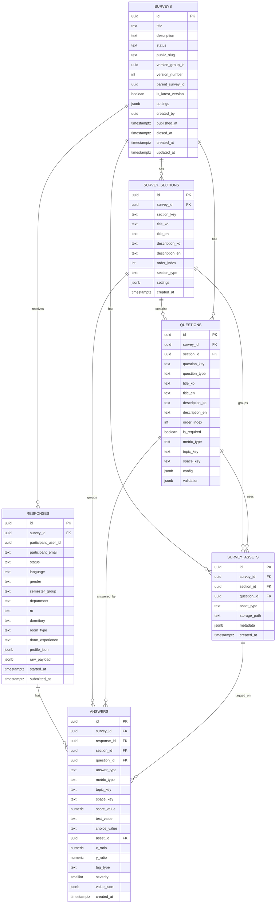

# Taglow Survey Admin PRD

# 1. 문서 개요

## 1.1 문서 목적

본 문서는 Taglow Survey의 **관리자 View** 요구사항을 최종 정리한다.

Taglow Survey 관리자 페이지는 단순히 설문을 생성하는 화면이 아니다. 관리자는 다음을 수행해야 한다.

```text
설문 생성
→ 섹션 구성
→ 섹션 안의 질문 작성
→ 경험 여부/후속 질문/선택형 구조 설정
→ 이미지 태깅 문항 설정
→ 한국어/영어 문구 입력
→ 미리보기
→ 공개 URL/QR 생성
→ 응답 수집
→ 기본 정보 기반 필터링
→ 섹션/질문/공간 분석
→ 개선 우선순위 도출
→ 보고 자료 생성
```

따라서 본 PRD는 다음 범위를 포함한다.

1. 관리자 로그인 및 권한 관리
2. 설문 목록과 대시보드
3. 섹션 기반 설문 빌더
4. 질문 유형별 작성 및 설정
5. 다국어 질문 입력
6. 경험 기반 분기 설정
7. 낮은 만족도 후속 질문 설정
8. 선택형 우선 응답 구조 설정
9. 이미지 태깅 문항 및 이미지 자산 관리
10. 설문 버전 관리
11. 미리보기 및 게시 전 검증
12. 공개 URL/QR 배포
13. 응답 현황 확인
14. 기본 정보 기반 Global Filter Bar
15. 섹션/질문/공간 기반 분석
16. 만족도·중요도·Gap·Borich·Locus 분석
17. 주관식 의견 묶음 및 AI 요약
18. 이미지 태깅 히트맵 분석
19. 응답 부족 그룹 경고
20. 보고서 초안 및 내보내기

## 1.2 제품 방향

Taglow Survey는 Google Form의 대체재가 아니라, **자치회·학생기구용 설문 분석 워크벤치**다.

관리자는 응답을 단순히 보는 것이 아니라, 다음 질문에 답할 수 있어야 한다.

- 어떤 섹션의 만족도가 가장 낮은가?
- 어떤 항목이 중요도는 높은데 만족도는 낮은가?
- 개선 우선순위 TOP 5는 무엇인가?
- 특정 생활관/인실/RC/학부에서 두드러지는 불편은 무엇인가?
- 주관식 의견은 어떤 주제로 묶이는가?
- 이미지 태깅에서 불편이 많이 찍힌 공간은 어디인가?
- 보고서에 바로 넣을 수 있는 카드와 근거는 무엇인가?

---

# 2. 제품 포지셔닝

## 2.1 단순 설문폼이 아니다

일반 설문 도구는 응답 수집에 집중한다. 하지만 자치회 설문에서 실제로 어려운 일은 응답 수집 이후다.

```text
응답 수집
→ 응답 정리
→ 필터링
→ 평균/빈도 계산
→ 주관식 분류
→ 그래프 제작
→ 보고 자료 작성
```

Taglow Survey는 이 과정을 관리자 페이지 안에서 연결한다.

```text
설문 생성
→ URL 배포
→ 응답 수집
→ 기본 정보 필터링
→ 섹션/문항/공간 분석
→ 시각화 카드 생성
→ 보고서/포스터 산출
```

## 2.2 SPSS를 복제하지 않는다

관리자는 전문 통계 사용자가 아니다. 따라서 통계 용어는 화면에서 쉬운 표현으로 바꾼다.

| 분석 개념 | 관리자 UI 표현 |
| --- | --- |
| 빈도분석 | 응답 비율 보기 |
| 평균/표준편차 | 평균 점수와 응답 편차 |
| 교차분석 | 선택지 관계 보기 |
| t-test | 두 그룹 차이 보기 |
| ANOVA | 여러 그룹 차이 보기 |
| p-value | 차이가 의미 있는지 |
| IPA | 중요도-만족도 매트릭스 |
| Locus for Focus | 요구수준 4분면 분석 |
| Borich 요구도 | 개선 우선순위 점수 |
| Text Clustering | 비슷한 의견 묶기 |
| Heatmap | 의견이 많이 찍힌 위치 보기 |

## 2.3 핵심 산출물

관리자 페이지의 핵심 산출물은 다음이다.

| 산출물 | 설명 | 우선순위 |
| --- | --- | --- |
| 응답 현황 요약 | 전체 응답 수, 제출 완료 수, 섹션별 응답률 | Must |
| Global Filter Bar | 성별, 학기, 학부, RC, 생활관, 인실, 거주 경험 필터 | Must |
| 섹션별 만족도 카드 | 섹션별 평균 점수와 응답 수 | Must |
| 문항별 평균 카드 | 질문별 평균 만족도/중요도/Gap | Must |
| 개선 우선순위 TOP 5 | 낮은 만족도, 높은 중요도, Gap, 태깅 밀집도, 주관식 빈도를 종합 | Must |
| 집단 비교 카드 | 생활관/인실/RC/학부별 비교 | Must |
| 주관식 의견 묶음 | 비슷한 의견을 묶고 대표 원문 제공 | Must |
| 이미지 태깅 히트맵 | 공간 이미지 위 태그 밀집도 표시 | Must |
| 응답 부족 그룹 경고 | 해석 주의가 필요한 표본 수 부족 그룹 안내 | Must |
| 보고서 초안 | 분석 카드와 근거를 묶어 보고 자료로 export | Should |
| Google Form/Excel 업로드 분석 | 기존 설문 결과 업로드 후 분석 | Could |

---

# 3. 사용자와 권한

## 3.1 사용자 유형

| 사용자 | 설명 | 주요 작업 |
| --- | --- | --- |
| 최고 관리자 | 서비스 또는 조직 차원의 관리자 | 관리자 접근 관리, 전체 설문 확인 |
| 설문 관리자 | 자치회·학생기구 담당자 | 설문 생성, 질문 작성, 배포, 분석 |
| 분석 담당자 | 응답 분석 담당자 | 필터링, 분석 카드 생성, 보고 자료 작성 |
| 읽기 전용 사용자 | 결과만 확인하는 사용자 | 응답 현황/분석 결과 열람 |
| 참여자 | 설문 URL로 접속하는 학생 | Google 로그인 후 설문 응답 |

## 3.2 관리자 로그인 요구사항

| ID | 요구사항 | 설명 | 우선순위 |
| --- | --- | --- | --- |
| A-AUTH-01 | Google 소셜 로그인 | 관리자는 Google 계정으로 로그인한다. | Must |
| A-AUTH-02 | 도메인 제한 | 관리자 접근은 `@handong.ac.kr` 계정으로 제한한다. | Must |
| A-AUTH-03 | 관리자 allowlist | 초기에는 허용된 관리자 이메일만 접근 가능하다. | Must |
| A-AUTH-04 | 역할 기반 권한 | 설문 생성/수정/분석/열람 권한을 분리할 수 있어야 한다. | Should |
| A-AUTH-05 | 접근 거부 안내 | 허용되지 않은 계정은 접근 불가 사유를 안내한다. | Must |

## 3.3 권한 정책

MVP에서는 복잡한 조직 권한 테이블을 기본 DB에 포함하지 않는다. 운영 방식은 다음 단계로 둔다.

```text
1단계: 관리자 이메일 allowlist 기반 접근
2단계: surveys.created_by 기준 소유자 권한
3단계: 필요 시 admin_members 또는 workspace_members 테이블 추가
```

핵심 설문 DB는 단순 구조를 유지한다.

```text
surveys
survey_sections
questions
survey_assets
responses
answers
```

---

# 4. 전체 플로우

## 4.1 관리자 설문 생성 플로우

```text
관리자 로그인
↓
관리자 대시보드 진입
↓
새 설문 생성 또는 템플릿 선택
↓
설문 기본 정보 입력
↓
참여자 접근 정책 설정
↓
다국어 설정
↓
섹션 생성
↓
섹션별 질문 작성
↓
경험 여부/후속 질문/선택지 구조 설정
↓
이미지 태깅 문항 설정
↓
설문 미리보기
↓
게시 전 검증
↓
공개 URL/QR 생성
↓
참여자에게 배포
```

## 4.2 응답 수집 후 분석 플로우

```text
참여자 URL 접속
↓
Google 로그인
↓
@handong.ac.kr 검증
↓
섹션별 응답
↓
최종 제출
↓
responses / answers 저장
↓
관리자 응답 현황 확인
↓
기본 정보 필터 적용
↓
섹션/질문/공간별 분석
↓
개선 우선순위 TOP 5 확인
↓
주관식/태깅 근거 확인
↓
보고 자료 내보내기
```

---

# 5. 정보 구조

```text
관리자 페이지
├─ 로그인 / 접근 제어
│  ├─ Google 로그인
│  ├─ @handong.ac.kr 도메인 검증
│  └─ 관리자 allowlist 확인
│
├─ 설문 대시보드
│  ├─ 전체 설문 목록
│  ├─ 상태별 필터
│  ├─ 최근 응답 수
│  ├─ 개선 우선순위 요약
│  ├─ 공개 URL 복사
│  ├─ 설문 복제
│  └─ 설문 종료/보관
│
├─ 설문 빌더
│  ├─ 설문 기본 정보
│  ├─ 참여자 접근 설정
│  ├─ 다국어 설정
│  ├─ 섹션 관리
│  ├─ 질문 관리
│  ├─ 이미지/공간 자산 관리
│  ├─ 경험 여부 설정
│  ├─ 낮은 만족도 후속 질문 설정
│  ├─ 선택형 우선 응답 설정
│  ├─ 질문 분기/필수 여부 설정
│  ├─ 참여자 화면 미리보기
│  │  ├─ 전체 플로우 미리보기
│  │  ├─ 섹션별 미리보기
│  │  ├─ 모바일/데스크톱 미리보기
│  │  ├─ 한국어/영어 미리보기
│  │  └─ 분기 조건 미리보기
│  └─ 게시 검증
│
├─ 버전 관리
│  ├─ 버전 목록
│  ├─ 현재 배포 버전
│  ├─ 새 버전 만들기
│  ├─ 변경 내역 확인
│  ├─ 버전 비교
│  └─ 버전별 응답/분석 보기
│
├─ 배포 관리
│  ├─ 공개 URL 생성
│  ├─ QR 코드 생성
│  ├─ 응답 가능 기간 설정
│  ├─ 중복 제출 제한 설정
│  └─ 설문 종료
│
├─ 응답 현황
│  ├─ 전체 응답 수
│  ├─ 제출 완료 수
│  ├─ 섹션별 응답률
│  ├─ 기본 정보 분포
│  ├─ 문항별 응답률
│  ├─ 응답 부족 그룹
│  └─ 데이터 품질 경고
│
├─ 분석 워크벤치
│  ├─ Global Filter Bar
│  ├─ 개선 우선순위 TOP 5
│  ├─ 섹션별 분석
│  ├─ 질문별 분석
│  ├─ 집단 비교
│  ├─ 중요도-만족도 분석
│  ├─ Borich/Locus 분석
│  ├─ 주관식 의견 묶음
│  ├─ 이미지 태깅 히트맵
│  └─ 근거 확인
│
└─ 보고서 생성
   ├─ 분석 카드 선택
   ├─ 카드 순서 편집
   ├─ 요약 문장 생성
   ├─ 원문/통계 근거 확인
   ├─ Markdown/PDF/PNG/Excel 내보내기
   └─ 보고서 초안 저장
```

---

# 6. 설문 대시보드 요구사항

## 6.1 대시보드 목적

관리자 첫 화면은 “기능 목록”이 아니라 **현재 어떤 의사결정을 해야 하는지 알려주는 요약 화면**이어야 한다.

## 6.2 대시보드 표시 요소

| ID | 기능 | 설명 | 우선순위 |
| --- | --- | --- | --- |
| D-DASH-01 | 전체 설문 목록 | 생성된 설문을 상태별로 보여준다. | Must |
| D-DASH-02 | 상태 배지 | draft, published, closed, archived를 표시한다. | Must |
| D-DASH-03 | 공개 URL 복사 | 배포 중 설문의 URL을 빠르게 복사한다. | Must |
| D-DASH-04 | 최근 응답 수 | 최근 24시간/7일 응답 수를 표시한다. | Should |
| D-DASH-05 | 개선 우선순위 요약 | 분석 가능한 설문에는 TOP 5 이슈를 요약한다. | Must |
| D-DASH-06 | 응답 부족 경고 | 특정 그룹의 N이 너무 낮으면 경고한다. | Must |
| D-DASH-07 | 설문 복제 | 기존 설문을 복제해 새 설문을 만든다. | Must |
| D-DASH-08 | 템플릿/고정 질문 세트 선택 | 생활관 정기 설문 등 사전 정의된 질문 세트를 불러온다. | Should |
| D-DASH-09 | Google Form/Excel 업로드 | 기존 응답 파일을 업로드해 분석 워크벤치에서 본다. | Could |

## 6.3 대시보드 예시

```text
생활관 정기 설문조사 25-2
상태: 배포 중
응답: 412명 제출 / 최근 24시간 38명
응답 부족: 창조관 1인실 N=4, 해석 주의
개선 우선순위 TOP 5:
1. 세탁기/건조기 관리
2. 냉난방 시설 운영
3. 화장실 청결
4. 점호방송 음량
5. 공부 공간 소음
```

---

# 7. 설문 생성 및 기본 설정

## 7.1 새 설문 생성

| ID | 요구사항 | 설명 | 우선순위 |
| --- | --- | --- | --- |
| S-CREATE-01 | 새 설문 생성 | 제목, 설명, 목적, 기간을 입력한다. | Must |
| S-CREATE-02 | 설문 유형 선택 | 일반 설문, 생활관 정기 설문, 행사 만족도, 시설 개선 설문 등 선택한다. | Should |
| S-CREATE-03 | 템플릿 선택 | 자주 쓰는 섹션/질문 구조를 불러온다. | Should |
| S-CREATE-04 | 고정 질문 세트 불러오기 | 생활관 정기 설문처럼 질문이 이미 정해진 경우 seed/config로 불러온다. | Should |
| S-CREATE-05 | 참여자 접근 정책 | 로그인 필수 여부, 도메인 제한, 중복 제출 제한을 설정한다. | Must |
| S-CREATE-06 | 다국어 사용 여부 | 한국어/영어 사용 여부와 기본 언어를 설정한다. | Must |

## 7.2 참여자 접근 설정

| ID | 요구사항 | 설명 | 우선순위 |
| --- | --- | --- | --- |
| S-ACCESS-01 | Google 로그인 필수 | 참여자는 Google 로그인 후 응답한다. | Must |
| S-ACCESS-02 | 이메일 도메인 제한 | `@handong.ac.kr`만 허용한다. | Must |
| S-ACCESS-03 | 중복 제출 제한 | 동일 user_id 또는 email 기준 중복 제출을 제한할 수 있다. | Must |
| S-ACCESS-04 | 응답 가능 기간 | 시작/종료일을 설정한다. | Must |
| S-ACCESS-05 | 익명 분석 안내 | 관리자에게는 기본 정보 기반 분석만 제공하고, 개인정보 노출은 제한한다. | Should |

---

# 8. 설문 버전 관리

## 8.1 목적

설문은 매 학기/행사/파일럿마다 조금씩 바뀐다. 또한 배포 후 응답이 시작되면 문항 구조를 마음대로 바꾸면 기존 응답과 새 응답의 의미가 달라진다.

따라서 버전 관리는 필수다.

## 8.2 설계 원칙

```text
응답이 없는 draft 설문: 자유롭게 수정 가능
응답이 시작된 published 설문: 문항 구조 보호
수정 필요 시: 새 버전으로 복제
응답/분석: 버전별로 분리 조회 가능
필요 시: 여러 버전을 통합 분석 가능
```

## 8.3 요구사항

| ID | 기능 | 설명 | 우선순위 |
| --- | --- | --- | --- |
| V-01 | 버전 번호 표시 | 설문 목록과 상세 화면에 v1, v2 등을 표시한다. | Must |
| V-02 | 배포 버전 표시 | 현재 참여자 URL에 연결된 버전을 명확히 표시한다. | Must |
| V-03 | 응답 시작 후 구조 보호 | 응답이 있는 설문은 질문 삭제/타입 변경을 제한한다. | Must |
| V-04 | 새 버전 만들기 | 기존 설문을 복제해 새 버전으로 수정한다. | Must |
| V-05 | 변경 내역 표시 | 추가/수정/삭제된 섹션과 질문을 보여준다. | Should |
| V-06 | 버전 비교 | 두 버전의 질문 구조 차이를 비교한다. | Should |
| V-07 | 버전별 분석 | 특정 버전 응답만 분석할 수 있다. | Must |
| V-08 | 통합 분석 | 같은 version_group 안의 여러 버전을 통합 분석할 수 있다. | Should |

## 8.4 DB 반영 방식

DB 테이블은 그대로 유지하되, `surveys`에 버전 필드를 둔다.

```text
surveys.version_group_id
surveys.version_number
surveys.parent_survey_id
surveys.is_latest_version
surveys.status
```

응답은 항상 특정 `survey_id`에 연결된다. 버전 그룹 통합 분석이 필요하면 같은 `version_group_id`를 가진 surveys를 묶어 조회한다.

---

# 9. 섹션 기반 설문 빌더

## 9.1 섹션 관리

설문은 반드시 섹션 단위로 구성된다.

| ID | 기능 | 설명 | 우선순위 |
| --- | --- | --- | --- |
| B-SEC-01 | 섹션 생성 | 섹션 제목과 설명을 입력한다. | Must |
| B-SEC-02 | 섹션 순서 변경 | 드래그 또는 순서값으로 섹션 순서를 바꾼다. | Must |
| B-SEC-03 | 섹션 타입 설정 | 기본 정보, 만족도, 공간 태깅, 자유 의견, 제출자 정보 등 타입을 설정한다. | Should |
| B-SEC-04 | 섹션 필수 여부 | 섹션 전체를 필수/선택으로 지정한다. | Should |
| B-SEC-05 | 섹션 진행률 표시 설정 | 참여자 페이지에서 섹션 진행률을 표시할지 설정한다. | Must |
| B-SEC-06 | 다국어 섹션명 | 한국어/영어 섹션명과 설명을 입력한다. | Must |

## 9.2 권장 섹션 예시

생활관 정기 설문조사는 다음 섹션 구조를 기본으로 사용할 수 있다.

```text
기본 정보
자치회 사업
입출입 및 점호 시스템
생활관 시설
세탁기 및 건조기
기타 생활
글로벌 라운지
제출자 정보
```

---

# 10. 질문 빌더

## 10.1 질문 유형

| question_type | 설명 | 예시 |
| --- | --- | --- |
| profile | 기본 정보 입력 | 성별, 학기, 학부, RC, 생활관, 인실 |
| experience | 경험 여부 확인 | 이용해봤다/들어봤지만 이용하지 않았다/처음 들었다 |
| scale | 5점 척도 응답 | 만족도, 중요도 |
| single_choice | 단일 선택 | 청소 선호 시간대 |
| multi_select | 복수 선택 | 주 사용 시간대 |
| ranking | 순위형 선택 | 방 배정 기준 우선순위 |
| text | 주관식 입력 | 개선 의견, 만족스러운 점 |
| image_tag | 이미지/도면 태깅 | 세탁실에서 불편한 위치 선택 |
| attention_check | 주의력 체크 | “만족을 선택해주세요” |
| identity | 제한적 식별 정보 | 학번, 이름 등 필요한 경우 |

## 10.2 질문 공통 필드

| 필드 | 설명 |
| --- | --- |
| section_id | 질문이 속한 섹션 |
| question_key | 질문 식별 키 |
| question_type | 질문 유형 |
| title_ko/title_en | 한국어/영어 질문 제목 |
| description_ko/description_en | 한국어/영어 설명 |
| order_index | 섹션 안의 질문 순서 |
| is_required | 필수 여부 |
| metric_type | satisfaction, importance, experience, none |
| topic_key | 분석 주제 키 |
| space_key | 공간 관련 키 |
| config | 질문 유형별 설정 JSON |
| validation | 입력 검증 규칙 JSON |

## 10.3 분석 연결 필드

모든 질문은 가능하면 분석 연결 정보를 가져야 한다.

```text
section_id
question_id
topic_key
space_key
metric_type
answer_type
```

관리자는 질문 카드에서 이 질문이 어떤 분석에 쓰이는지 확인할 수 있어야 한다.

예시:

```text
질문: 세탁기 관리 만족도
분석 연결:
- 섹션: 세탁기 및 건조기
- 주제: laundry_management
- 공간: laundry_room
- 지표: satisfaction
- 분석 활용: 섹션 평균, 생활관별 비교, 개선 우선순위
```

---

# 11. 경험 여부 기반 응답 설정

## 11.1 목적

참여자가 경험하지 않은 항목까지 만족도를 답하게 하면 응답 피로도와 데이터 품질 문제가 생긴다.

관리자는 “내가 경험한 것만 답하기” 구조를 설정할 수 있어야 한다.

## 11.2 관리자 설정 항목

| ID | 설정 | 설명 | 우선순위 |
| --- | --- | --- | --- |
| EXP-SET-01 | 경험 항목 목록 | 자치회 사업, 시설, 공간 등 경험 여부를 물을 항목을 만든다. | Must |
| EXP-SET-02 | 경험 상태 옵션 | 경험 있음, 들어봤지만 미이용, 처음 들음, 해당 없음 | Must |
| EXP-SET-03 | 경험자만 만족도 질문 노출 | 경험 있음인 경우에만 후속 만족도 질문을 보여준다. | Must |
| EXP-SET-04 | 미경험 이유 수집 | 미이용 이유를 선택형으로 받을 수 있다. | Should |
| EXP-SET-05 | 인지도 부족 저장 | 처음 들음은 홍보 부족 이슈로 분석 가능하게 저장한다. | Should |
| EXP-SET-06 | 참여자 미리보기 | 설정한 분기 흐름을 미리 볼 수 있다. | Must |

## 11.3 참여자 화면 문구 예시

```text
이번 학기 오피스 아워를 이용해본 적이 있나요?

- 이용해봤다
- 들어봤지만 이용하지 않았다
- 처음 들어봤다
- 해당 없음
```

## 11.4 분석 연결

관리자는 경험 여부 결과를 다음 분석에 활용한다.

- 경험자만 만족도 평균 계산
- 미이용자 이유 빈도
- 처음 들은 비율
- 해당 없음 제외
- 자치회 사업 홍보 필요도 판단

---

# 12. 낮은 만족도 후속 질문 설정

## 12.1 목적

모든 항목에 주관식 이유를 묻는 것은 참여자에게 부담이 크다. 따라서 만족도 점수가 낮을 때만 후속 질문을 보여준다.

## 12.2 관리자 설정 항목

| ID | 설정 | 설명 | 우선순위 |
| --- | --- | --- | --- |
| LOW-SET-01 | 노출 기준 | 만족도 1~2점, 1~3점 등 후속 질문 기준을 설정한다. | Must |
| LOW-SET-02 | 후속 질문 문구 | 낮은 만족도 이유 질문 문구를 설정한다. | Must |
| LOW-SET-03 | 이유 선택지 | 고장, 청결, 접근성, 안내 부족 등 선택지를 설정한다. | Must |
| LOW-SET-04 | 한 줄 설명 여부 | 선택 후 짧은 설명을 받을지 설정한다. | Should |
| LOW-SET-05 | 이미지 태깅 유도 | 공간 문제일 때 이미지 태깅 문항으로 연결할 수 있다. | Should |
| LOW-SET-06 | 분석 카테고리 연결 | 선택지를 분석 카테고리에 연결한다. | Must |

## 12.3 기본 이유 선택지 예시

```text
- 기기 수가 부족함
- 기기 성능이 낮음
- 청소 상태가 좋지 않음
- 고장이 잦음
- 사용 방법 안내가 부족함
- 위치가 불편함
- 소음이 큼
- 기타
```

---

# 13. 선택형 우선 응답 구조 설정

## 13.1 목적

주관식만 제공하면 응답 품질이 들쭉날쭉하고 분류 비용이 커진다. 따라서 관리자는 자유 입력 전에 선택형 카테고리를 제공해야 한다.

## 13.2 관리자 설정 항목

| ID | 기능 | 설명 | 우선순위 |
| --- | --- | --- | --- |
| CHOICE-FIRST-01 | 선택지 템플릿 | 시설/청결/제도/소음/사업 등 템플릿을 제공한다. | Must |
| CHOICE-FIRST-02 | 선택형 + 한 줄 입력 | 선택지를 먼저 고르고 필요한 경우 한 줄 의견을 받는다. | Must |
| CHOICE-FIRST-03 | 분석 카테고리 연결 | 선택지가 topic_key 또는 issue_type으로 저장된다. | Must |
| CHOICE-FIRST-04 | 기타 입력 | 기타 선택 시 직접 입력을 허용한다. | Must |
| CHOICE-FIRST-05 | 중복 선택 여부 | 단일/복수 선택을 설정한다. | Should |

## 13.3 템플릿 예시

| 템플릿 | 선택지 예시 |
| --- | --- |
| 시설 문제 | 고장, 부족, 위치 불편, 노후화, 안내 부족 |
| 청결 문제 | 쓰레기, 냄새, 곰팡이, 청소 부족, 비품 부족 |
| 제도 문제 | 시간 불편, 절차 복잡, 안내 부족, 형평성 문제 |
| 소음 문제 | 생활 소음, 점호방송, 공용공간 소음, 방음 문제 |
| 자치회 사업 | 홍보 부족, 참여 어려움, 실효성 부족, 만족 |

---

# 14. 다국어 질문 입력

## 14.1 목적

관리자는 한국어/영어 질문을 입력할 수 있고, 참여자 페이지는 선택 언어에 따라 문구를 렌더링한다.

## 14.2 요구사항

| ID | 기능 | 설명 | 우선순위 |
| --- | --- | --- | --- |
| LANG-01 | 기본 언어 설정 | 설문의 기본 언어를 설정한다. | Must |
| LANG-02 | 한국어 문구 입력 | 섹션/질문/선택지의 한국어 문구를 입력한다. | Must |
| LANG-03 | 영어 문구 입력 | 섹션/질문/선택지의 영어 문구를 입력한다. | Should |
| LANG-04 | 미입력 fallback | 영어가 없으면 한국어를 표시하거나 관리자에게 경고한다. | Must |
| LANG-05 | 언어별 미리보기 | 참여자 화면을 한국어/영어로 미리 본다. | Should |

## 14.3 저장 원칙

응답 데이터는 언어별로 따로 저장하지 않는다.

```text
질문 문구: questions.title_ko / title_en 또는 config.translations
선택지 문구: questions.config.options[].label_ko / label_en
응답 저장: question_id, choice_value, score_value, value_json
```

---

# 15. 이미지/도면 태깅 문항 관리

## 15.1 목적

공간에 대한 건의는 텍스트만으로는 위치 맥락이 부족하다. 관리자는 이미지나 도면을 업로드하고, 참여자가 불편 위치를 직접 찍을 수 있도록 설정해야 한다.

## 15.2 관리자 설정 항목

| ID | 기능 | 설명 | 우선순위 |
| --- | --- | --- | --- |
| IMG-01 | 이미지 업로드 | 공간 사진/도면을 업로드한다. | Must |
| IMG-02 | 이미지 메타데이터 | space_key, 공간명, 설명을 저장한다. | Must |
| IMG-03 | 태그 유형 설정 | 불편, 개선, 위험, 만족, 안내 부족 등 유형을 설정한다. | Must |
| IMG-04 | 최대 태그 수 | 문항당 최대 태그 수를 설정한다. | Must |
| IMG-05 | 원문 필수 여부 | 태그마다 설명을 필수로 받을지 설정한다. | Must |
| IMG-06 | 확대/축소 허용 | 작은 요소를 찍을 수 있도록 확대/축소를 설정한다. | Should |
| IMG-07 | 참여자 문구 쉬운 표현 | “이미지 태깅” 대신 “사진에서 불편한 위치를 눌러주세요”로 안내한다. | Must |

## 15.3 저장 원칙

```text
survey_assets: 이미지 파일 경로와 메타데이터
answers: asset_id, x_ratio, y_ratio, tag_type, severity, text_value
```

좌표는 반드시 이미지 크기와 무관하게 `0~1` 비율로 저장한다.

---

# 16. 참여자 화면 미리보기와 게시 전 검증

## 16.1 목적

관리자는 설문을 공개하기 전에 **참여자가 실제로 보게 될 화면과 거의 동일한 형태**로 설문을 확인할 수 있어야 한다.

미리보기는 단순히 질문 목록을 확인하는 기능이 아니라, 다음을 검수하는 기능이다.

```text
섹션 순서
+ 질문 문구
+ 다국어 문구
+ 선택지/척도 UI
+ 이미지 태깅 UI
+ 경험 여부/낮은 만족도 분기
+ 필수 문항 검증
+ 제출 전 검토 화면
+ 모바일 화면에서의 응답 피로도
```

미리보기는 실제 참여자 URL과 동일한 렌더링 컴포넌트를 사용하되, 관리자 전용 `preview_mode`로 동작한다.

---

## 16.2 미리보기 진입 위치

| ID | 진입 위치 | 설명 | 우선순위 |
| --- | --- | --- | --- |
| PREVIEW-ENTRY-01 | 설문 빌더 상단 | 작성 중인 설문 전체를 바로 미리 본다. | Must |
| PREVIEW-ENTRY-02 | 섹션 카드 | 특정 섹션만 참여자 화면으로 미리 본다. | Must |
| PREVIEW-ENTRY-03 | 질문 편집 패널 | 특정 질문이 참여자 화면에서 어떻게 보이는지 확인한다. | Should |
| PREVIEW-ENTRY-04 | 게시 전 검증 화면 | 공개 전 최종 확인 단계에서 미리보기를 다시 제공한다. | Must |
| PREVIEW-ENTRY-05 | 배포 관리 화면 | 공개 URL 생성 후 실제 URL과 미리보기 URL을 구분해 보여준다. | Should |

---

## 16.3 미리보기 모드

| ID | 모드 | 설명 | 우선순위 |
| --- | --- | --- | --- |
| PREVIEW-01 | 전체 플로우 미리보기 | 시작 화면부터 제출 전 검토 화면까지 전체 참여자 여정을 확인한다. | Must |
| PREVIEW-02 | 섹션별 미리보기 | 특정 섹션만 선택해 해당 섹션의 질문 흐름을 확인한다. | Must |
| PREVIEW-03 | 질문 단위 미리보기 | 질문 편집 중 해당 질문의 참여자 렌더링을 확인한다. | Should |
| PREVIEW-04 | 분기 미리보기 | 경험 여부, 낮은 만족도, 선택값 조건에 따라 어떤 질문이 노출되는지 확인한다. | Must |
| PREVIEW-05 | 다국어 미리보기 | 한국어/영어 문구가 각각 어떻게 렌더링되는지 확인한다. | Should |
| PREVIEW-06 | 모바일 미리보기 | 참여자 주요 환경인 모바일 화면 기준으로 확인한다. | Must |
| PREVIEW-07 | 데스크톱 미리보기 | PC/태블릿 화면에서도 레이아웃이 깨지지 않는지 확인한다. | Should |
| PREVIEW-08 | 이미지 태깅 미리보기 | 이미지 확대/축소, 위치 터치, 핀 표시, 태그 유형 선택, 설명 입력을 확인한다. | Must |
| PREVIEW-09 | 제출 전 검토 미리보기 | 응답 요약 화면과 수정 진입이 정상 동작하는지 확인한다. | Must |

---

## 16.4 미리보기 동작 원칙

| ID | 원칙 | 설명 | 우선순위 |
| --- | --- | --- | --- |
| PREVIEW-RULE-01 | 실제 참여자 렌더러 재사용 | 별도 mock 화면이 아니라 참여자 페이지와 같은 렌더링 컴포넌트를 사용한다. | Must |
| PREVIEW-RULE-02 | 실제 응답 저장 금지 | 미리보기에서 입력한 값은 `responses`와 `answers`에 저장하지 않는다. | Must |
| PREVIEW-RULE-03 | 임시 입력값은 세션 내 유지 | 미리보기 중 입력한 값은 화면 이동 확인을 위해 세션 내에서만 유지한다. | Should |
| PREVIEW-RULE-04 | 게시 전 상태에서도 동작 | draft 상태 설문도 미리볼 수 있어야 한다. | Must |
| PREVIEW-RULE-05 | 공개 URL과 구분 | 미리보기 URL은 참여자 공개 URL과 명확히 구분한다. | Must |
| PREVIEW-RULE-06 | 관리자 인증 필요 | 미리보기 페이지는 관리자 권한이 있는 사용자만 접근할 수 있다. | Must |
| PREVIEW-RULE-07 | 오류 위치 표시 | 누락된 문구, 선택지, 이미지, 분기 조건 오류를 해당 섹션/질문 위치에 표시한다. | Must |

---

## 16.5 미리보기 URL 정책

미리보기는 공개 URL과 분리한다.

```text
공개 참여자 URL: /survey/{public_slug}
관리자 미리보기 URL: /admin/surveys/{survey_id}/preview
섹션 미리보기 URL: /admin/surveys/{survey_id}/preview?section_id={section_id}
언어 미리보기 URL: /admin/surveys/{survey_id}/preview?locale=ko 또는 locale=en
디바이스 미리보기: /admin/surveys/{survey_id}/preview?device=mobile
```

미리보기 URL은 관리자 인증과 권한 검사를 통과한 사용자만 접근할 수 있다.

---

## 16.6 미리보기 화면 구성

미리보기 화면은 좌우 또는 상하 구조로 구성한다.

```text
상단 바
- 설문명
- 현재 상태: draft / published / closed
- 미리보기 모드 배지
- 언어 선택: 한국어 / English
- 디바이스 선택: Mobile / Desktop
- 섹션 이동 드롭다운
- 게시 전 검증 버튼

본문
- 실제 참여자 화면 렌더링
- 시작 화면
- 섹션 진행률
- 질문 카드
- 이미지 태깅 UI
- 제출 전 검토 화면

오른쪽 또는 하단 패널
- 현재 섹션/질문 메타데이터
- 필수값/문구/선택지/이미지 누락 경고
- 분기 조건 테스트 입력
- 편집 화면으로 돌아가기 버튼
```

---

## 16.7 분기 조건 미리보기

관리자는 조건부 문항이 제대로 동작하는지 확인할 수 있어야 한다.

| ID | 기능 | 설명 | 우선순위 |
| --- | --- | --- | --- |
| PREVIEW-BRANCH-01 | 경험 여부 시뮬레이션 | “경험 있음/들어봤지만 미이용/처음 들어봄/해당 없음” 선택 시 노출 질문을 확인한다. | Must |
| PREVIEW-BRANCH-02 | 낮은 만족도 시뮬레이션 | 만족도 1~2점 선택 시 후속 질문이 노출되는지 확인한다. | Must |
| PREVIEW-BRANCH-03 | 복수응답 조건 확인 | 특정 선택지 선택 시 후속 질문이 노출되는지 확인한다. | Should |
| PREVIEW-BRANCH-04 | 필수 문항 누락 확인 | 필수 문항을 비워둔 상태에서 다음 단계 이동/제출 제한을 확인한다. | Must |

---

## 16.8 다국어 미리보기

관리자가 질문을 한국어/영어로 입력한 경우, 참여자 화면에서 언어별 문구를 확인할 수 있어야 한다.

| ID | 기능 | 설명 | 우선순위 |
| --- | --- | --- | --- |
| PREVIEW-LANG-01 | 언어 토글 | 한국어/영어 화면을 즉시 전환한다. | Must |
| PREVIEW-LANG-02 | 누락 문구 경고 | 영어 문구가 누락된 질문/선택지를 표시한다. | Should |
| PREVIEW-LANG-03 | fallback 확인 | 영어 문구가 없을 때 한국어 fallback을 사용할지 경고할지 설정에 따라 확인한다. | Should |
| PREVIEW-LANG-04 | 이미지 태깅 안내문 확인 | 태깅 유형, 안내 문구, 버튼 문구가 언어별로 표시되는지 확인한다. | Should |

---

## 16.9 이미지 태깅 미리보기

공간 건의 문항은 이미지 위 위치 입력이 핵심이므로, 게시 전 반드시 미리보기에서 검수한다.

| ID | 기능 | 설명 | 우선순위 |
| --- | --- | --- | --- |
| PREVIEW-TAG-01 | 이미지 표시 확인 | 이미지가 모바일 화면에서 잘리는지, 비율이 유지되는지 확인한다. | Must |
| PREVIEW-TAG-02 | 좌표 입력 확인 | 이미지 위 터치/클릭 시 핀이 정상 표시되는지 확인한다. | Must |
| PREVIEW-TAG-03 | 태그 유형 확인 | 불편/개선/위험/만족 등 태그 유형이 정상 표시되는지 확인한다. | Must |
| PREVIEW-TAG-04 | 설명 입력 확인 | 태그 원문 입력 필수 여부를 확인한다. | Must |
| PREVIEW-TAG-05 | 최대 태그 수 확인 | 문항별 최대 태그 수 제한이 정상 동작하는지 확인한다. | Must |
| PREVIEW-TAG-06 | 좌표 정규화 확인 | 저장 전 좌표가 0~1 비율로 계산되는지 개발/검증 모드에서 확인할 수 있다. | Should |

---

## 16.10 게시 전 검증

| ID | 검증 | 설명 | 우선순위 |
| --- | --- | --- | --- |
| VALID-01 | 필수 섹션 존재 | 최소 하나 이상의 섹션이 있어야 한다. | Must |
| VALID-02 | 필수 질문 존재 | 섹션 안에 질문이 있어야 한다. | Must |
| VALID-03 | 기본 정보 필드 확인 | 필터에 필요한 기본 정보 문항이 설정되어야 한다. | Must |
| VALID-04 | 질문 타입별 config 확인 | 선택지/척도/태깅 이미지 등 필수 설정을 확인한다. | Must |
| VALID-05 | 이미지 태깅 자산 확인 | image_tag 문항에는 asset_id가 있어야 한다. | Must |
| VALID-06 | 다국어 누락 확인 | 영어 사용 시 누락된 문구를 표시한다. | Should |
| VALID-07 | 분기 조건 검증 | 참조하는 질문/값이 존재하는지 확인한다. | Must |
| VALID-08 | 공개 URL 중복 확인 | public_slug 중복을 방지한다. | Must |
| VALID-09 | 미리보기 통과 여부 | 게시 전 최소 1회 전체 미리보기를 완료하도록 권장한다. | Should |
| VALID-10 | 태깅 문항 미리보기 여부 | image_tag 문항이 있는 경우 태깅 UI 미리보기 완료 여부를 표시한다. | Should |

---

# 17. 배포 관리

## 17.1 공개 URL 생성

설문이 published 상태가 되면 공개 URL이 생성된다.

```text
/survey/{public_slug}
```

## 17.2 요구사항

| ID | 기능 | 설명 | 우선순위 |
| --- | --- | --- | --- |
| DIST-01 | 공개 URL 생성 | 설문 공개 시 URL을 생성한다. | Must |
| DIST-02 | QR 코드 생성 | URL 기반 QR 코드를 생성한다. | Must |
| DIST-03 | URL 복사 | 관리자 화면에서 바로 복사 가능하다. | Must |
| DIST-04 | 응답 기간 설정 | starts_at, ends_at을 설정한다. | Must |
| DIST-05 | 설문 종료 | closed 상태로 변경해 추가 응답을 막는다. | Must |
| DIST-06 | 미리보기 URL | 게시 전 관리자 미리보기 URL을 제공한다. | Should |

---

# 18. 응답 현황

## 18.1 목적

응답 현황은 단순 카운트가 아니라, 분석 가능성을 판단하는 화면이다.

## 18.2 요구사항

| ID | 기능 | 설명 | 우선순위 |
| --- | --- | --- | --- |
| R-STATUS-01 | 전체 응답 수 | 제출 완료 기준 전체 응답 수를 보여준다. | Must |
| R-STATUS-02 | 진행 중 응답 수 | 서버에 저장된 in_progress가 있을 경우 표시한다. MVP에서는 선택 사항이다. | Could |
| R-STATUS-03 | 기본 정보 분포 | 성별, 학기, 학부, RC, 생활관, 인실 분포를 보여준다. | Must |
| R-STATUS-04 | 섹션별 응답률 | 섹션별 필수 문항 완료율을 보여준다. | Must |
| R-STATUS-05 | 문항별 응답률 | 질문별 응답률을 보여준다. | Should |
| R-STATUS-06 | 데이터 품질 경고 | 주의력 체크 실패, 필수값 누락, 응답 부족을 표시한다. | Must |
| R-STATUS-07 | 응답 부족 그룹 | 필터 그룹별 N이 기준 이하이면 해석 주의로 표시한다. | Must |

---

# 19. Global Filter Bar

## 19.1 목적

관리자는 참여자 기본 정보에 따라 응답을 필터링할 수 있어야 한다.

기본 정보는 `responses` 컬럼에 저장되므로, SQL에서 `answers`와 `responses`를 조인해 필터링한다.

## 19.2 필터 항목

| ID | 필터 | 저장 컬럼 | 우선순위 |
| --- | --- | --- | --- |
| GF-01 | 성별 | responses.gender | Must |
| GF-02 | 이수 학기 | responses.semester_group | Must |
| GF-03 | 학부 | responses.department | Must |
| GF-04 | 소속 RC | responses.rc | Must |
| GF-05 | 거주 생활관 | responses.dormitory | Must |
| GF-06 | 인실 | responses.room_type | Must |
| GF-07 | 생활관 거주 경험 | responses.dorm_experience | Must |
| GF-08 | 응답 언어 | responses.language | Should |
| GF-09 | 설문 버전 | surveys.version_number 또는 survey_id | Must |

## 19.3 UX 요구사항

- 모든 분석 화면 상단에 고정한다.
- 필터 적용 전/후 응답 수를 보여준다.
- N이 기준 이하이면 `해석 주의` 배지를 표시한다.
- 필터 조건은 보고서 카드에 자동 기록된다.
- 자주 쓰는 필터 조합은 프리셋으로 저장할 수 있다. 프리셋 저장은 Should 범위다.

---

# 20. 분석 워크벤치

## 20.1 분석 워크벤치 원칙

분석 워크벤치는 관리자가 “무엇을 개선해야 하는지” 빠르게 알 수 있게 해야 한다.

우선순위는 다음이다.

```text
1. 개선 우선순위 TOP 5
2. 섹션별 낮은 만족도
3. 중요도는 높고 만족도는 낮은 항목
4. 특정 집단에서 두드러지는 문제
5. 주관식 의견 묶음
6. 이미지 태깅 밀집 위치
```

## 20.2 분석 유형

| ID | 분석 | 설명 | 우선순위 |
| --- | --- | --- | --- |
| A-01 | 응답 비율 보기 | 선택형/복수응답/경험 여부 비율 | Must |
| A-02 | 평균 점수 보기 | 만족도/중요도 평균과 응답 수 | Must |
| A-03 | Gap 보기 | 중요도 - 만족도 | Must |
| A-04 | 개선 우선순위 점수 | Borich 등으로 우선순위 계산 | Must |
| A-05 | 요구수준 4분면 | Locus for Focus 또는 중요도-만족도 매트릭스 | Must |
| A-06 | 집단 비교 | 생활관/인실/RC/학부별 평균 비교 | Must |
| A-07 | 주관식 의견 묶음 | 비슷한 의견을 카테고리로 묶음 | Must |
| A-08 | 이미지 태깅 히트맵 | 공간 이미지 위 좌표 기반 의견 밀집도 | Must |
| A-09 | 응답 부족 경고 | 표본 수 부족 그룹 경고 | Must |
| A-10 | 보고서 카드 생성 | 분석 결과를 보고용 카드로 저장/내보내기 | Should |

---

# 21. 개선 우선순위 TOP 5

## 21.1 목적

관리자가 가장 먼저 봐야 할 화면은 복잡한 통계표가 아니라, “지금 무엇을 개선해야 하는가”이다.

## 21.2 계산에 활용할 수 있는 신호

| 신호 | 데이터 |
| --- | --- |
| 낮은 만족도 | answers.metric_type = satisfaction, score_value 낮음 |
| 높은 중요도 | answers.metric_type = importance, score_value 높음 |
| Gap | importance 평균 - satisfaction 평균 |
| Borich | 중요도 × Gap 기반 점수 |
| 주관식 빈도 | text 답변의 topic_key/issue_type 빈도 |
| 태깅 밀집도 | image_tag 답변의 asset_id/x_ratio/y_ratio/tag_type 밀집 |
| 심각도 | answers.severity |
| 응답 수 | count(*) |

## 21.3 관리자 UI 예시

```text
개선 우선순위 TOP 5
1. 세탁기 및 건조기 관리 — 만족도 2.1 / 중요도 4.7 / 태그 42건
2. 화장실 청결 — 만족도 2.4 / 주관식 38건
3. 냉난방 시설 운영 — Gap 1.8
4. 점호방송 음량 — 특정 생활관에서 낮음
5. 공부 공간 소음 — 주관식 묶음 21건
```

---

# 22. 만족도·중요도·Gap·Borich·Locus 분석

## 22.1 저장 구조

`answers`의 다음 컬럼을 사용한다.

```text
answer_type = scale
metric_type = satisfaction 또는 importance
score_value = 1~5
topic_key / space_key / section_id / question_id
```

중요도와 만족도가 별도 질문으로 저장되더라도 같은 `topic_key` 또는 분석 연결 키를 기준으로 집계한다.

## 22.2 Gap 계산

```text
Gap = avg_importance - avg_satisfaction
```

## 22.3 Borich 점수 예시

```text
Borich score = avg_importance * (avg_importance - avg_satisfaction)
```

## 22.4 Locus/4분면 분류 예시

```text
중요도 평균 이상 + 만족도 평균 이하 = 최우선 개선
중요도 평균 이상 + 만족도 평균 이상 = 유지 강화
중요도 평균 이하 + 만족도 평균 이하 = 점진 개선
중요도 평균 이하 + 만족도 평균 이상 = 현 수준 유지
```

## 22.5 요구사항

| ID | 기능 | 설명 | 우선순위 |
| --- | --- | --- | --- |
| SCALE-01 | 평균 계산 | 문항/섹션/topic별 평균을 계산한다. | Must |
| SCALE-02 | Gap 계산 | 중요도와 만족도 차이를 계산한다. | Must |
| SCALE-03 | Borich 계산 | 개선 우선순위 점수를 계산한다. | Must |
| SCALE-04 | Locus 분류 | 4분면 분류를 제공한다. | Must |
| SCALE-05 | 필터 적용 | 기본 정보 필터 적용 후 다시 계산한다. | Must |
| SCALE-06 | 표본 수 표시 | 모든 결과에 N을 표시한다. | Must |

---

# 23. 집단 비교 분석

## 23.1 목적

관리자는 기본 정보별 차이를 확인할 수 있어야 한다.

예시:

- 생활관별 세탁기 만족도 비교
- 인실별 방 배정 만족도 비교
- RC별 자치회 사업 인지도 비교
- 학부별 공부 공간 불편 의견 비교

## 23.2 요구사항

| ID | 기능 | 설명 | 우선순위 |
| --- | --- | --- | --- |
| GROUP-01 | 비교 기준 선택 | gender, semester_group, department, rc, dormitory, room_type 등을 선택한다. | Must |
| GROUP-02 | 질문/섹션 선택 | 비교할 섹션 또는 질문을 선택한다. | Must |
| GROUP-03 | 평균 비교 | 그룹별 평균과 N을 보여준다. | Must |
| GROUP-04 | 최고/최저 표시 | 가장 높은/낮은 그룹을 강조한다. | Must |
| GROUP-05 | 해석 주의 | N이 낮은 그룹은 해석 주의 표시한다. | Must |
| GROUP-06 | 유의성 표시 | 차이가 의미 있는지 표시한다. | Should |

---

# 24. 주관식 의견 분석

## 24.1 목적

주관식 응답은 “전체 목록”보다 “의견 묶음”으로 먼저 보여줘야 한다.

## 24.2 요구사항

| ID | 기능 | 설명 | 우선순위 |
| --- | --- | --- | --- |
| TEXT-01 | 원문 목록 | 주관식 원문 전체를 볼 수 있다. | Must |
| TEXT-02 | 키워드 검색 | 특정 단어를 포함한 원문을 검색한다. | Must |
| TEXT-03 | 선택형 카테고리 필터 | topic_key, issue_type 등으로 필터링한다. | Must |
| TEXT-04 | 의견 묶음 | 비슷한 의견을 묶어 빈도와 대표 원문을 보여준다. | Must |
| TEXT-05 | AI 요약 | 의견 묶음별 요약 문장을 생성한다. | Should |
| TEXT-06 | 근거 확인 | 요약에 포함된 실제 원문을 확인한다. | Must |
| TEXT-07 | 관리자 수정 | 묶음명 수정, 병합, 분리, 제외를 지원한다. | Should |

## 24.3 AI 요약 원칙

AI 요약은 단독으로 신뢰되어서는 안 된다.

모든 요약은 다음을 함께 제공한다.

```text
요약 문장
관련 원문 수
대표 원문 3개
전체 원문 보기 버튼
보고서 반영 여부
```

---

# 25. 이미지 태깅 히트맵 분석

## 25.1 목적

공간 문제는 위치 맥락이 중요하다. 이미지 태깅 결과는 관리자에게 히트맵과 원문으로 제공한다.

## 25.2 요구사항

| ID | 기능 | 설명 | 우선순위 |
| --- | --- | --- | --- |
| HEAT-01 | 이미지별 보기 | 특정 이미지/공간의 태그를 본다. | Must |
| HEAT-02 | 태그 유형 필터 | 불편, 개선, 위험, 만족 등으로 필터링한다. | Must |
| HEAT-03 | 기본 정보 필터 적용 | 생활관/인실/RC 등 필터 적용 후 히트맵을 본다. | Must |
| HEAT-04 | 좌표 표시 | x_ratio/y_ratio 기반으로 핀 또는 히트맵을 그린다. | Must |
| HEAT-05 | 밀집 위치 표시 | 태그가 많이 찍힌 위치를 강조한다. | Must |
| HEAT-06 | 위치별 원문 보기 | 핀/영역 클릭 시 원문을 본다. | Must |
| HEAT-07 | 보고서 카드 저장 | 히트맵 이미지를 보고서에 포함한다. | Should |

---

# 26. 응답 부족 그룹 경고

## 26.1 목적

필터를 세게 걸면 특정 그룹의 표본 수가 너무 작아질 수 있다. 관리자는 해석 주의가 필요한 결과를 명확히 알아야 한다.

## 26.2 요구사항

| ID | 기능 | 설명 | 우선순위 |
| --- | --- | --- | --- |
| LOW-N-01 | N 표시 | 모든 분석 결과에 응답 수 N을 표시한다. | Must |
| LOW-N-02 | 기준값 설정 | 예: N < 10이면 해석 주의 | Must |
| LOW-N-03 | 해석 주의 배지 | 결과 카드에 배지를 표시한다. | Must |
| LOW-N-04 | 응답 부족 그룹 목록 | 부족한 그룹을 별도로 보여준다. | Must |
| LOW-N-05 | 보고서 포함 제어 | 해석 주의 결과를 보고서에 포함할지 선택한다. | Should |

---

# 27. 보고서/포스터 생성

## 27.1 목적

관리자는 분석 결과를 바로 보고 자료로 전환할 수 있어야 한다.

## 27.2 요구사항

| ID | 기능 | 설명 | 우선순위 |
| --- | --- | --- | --- |
| REPORT-01 | 분석 카드 선택 | 우선순위, 집단 비교, 주관식, 히트맵 카드를 선택한다. | Must |
| REPORT-02 | 요약 문장 생성 | 카드별 해석 문장을 생성한다. | Should |
| REPORT-03 | 근거 연결 | 요약 문장에 통계/원문/태깅 근거를 연결한다. | Must |
| REPORT-04 | 카드 순서 변경 | 보고서 내 카드 순서를 조정한다. | Should |
| REPORT-05 | Markdown 내보내기 | 보고서 초안을 Markdown으로 내보낸다. | Must |
| REPORT-06 | PNG/PDF 내보내기 | 포스터/보고서용 이미지 또는 PDF를 만든다. | Should |
| REPORT-07 | Excel/CSV 내보내기 | 분석 테이블을 내보낸다. | Should |

## 27.3 보고서 초안 구성 예시

```text
제목: 25-2 생활관 정기 설문조사 주요 결과
1. 응답자 개요
2. 개선 우선순위 TOP 5
3. 생활관 시설 섹션 주요 이슈
4. 세탁실 이미지 태깅 히트맵
5. 주관식 의견 묶음
6. 제안 조치
7. 근거 데이터
```

---

# 28. Google Form/Excel 결과 업로드 분석

## 28.1 목적

정식 Taglow 설문으로 수집하지 않은 기존 설문 결과도 Taglow 분석 워크벤치에서 분석할 수 있으면 전환 비용이 줄어든다.

## 28.2 범위

이 기능은 MVP Must가 아니다. Should/Could 범위로 둔다.

## 28.3 요구사항

| ID | 기능 | 설명 | 우선순위 |
| --- | --- | --- | --- |
| IMPORT-01 | CSV/Excel 업로드 | 기존 응답 파일을 업로드한다. | Could |
| IMPORT-02 | 컬럼 매핑 | 컬럼을 기본 정보/질문/응답 유형에 매핑한다. | Could |
| IMPORT-03 | 질문 자동 생성 | 업로드된 컬럼을 questions로 변환한다. | Could |
| IMPORT-04 | 응답 저장 | rows를 responses/answers로 변환한다. | Could |
| IMPORT-05 | 분석 워크벤치 연결 | 업로드 결과도 동일 분석 화면에서 본다. | Could |

---

# 29. 데이터 모델

## 29.1 단순 DB 구조

```text
surveys
survey_sections
questions
survey_assets
responses
answers
```

## 29.2 ERD



## 29.3 핵심 저장 원칙

| 데이터 | 저장 위치 |
| --- | --- |
| 설문 기본 정보 | surveys |
| 섹션 정보 | survey_sections |
| 질문 정보 | questions |
| 이미지/도면 | survey_assets |
| 참여자 1명의 제출 단위 | responses |
| 기본 정보 필터 | responses 컬럼 |
| 모든 질문 응답 | answers |
| 이미지 태깅 좌표 | answers.x_ratio / y_ratio |
| 복수응답/순위형/복잡한 값 | answers.value_json |

---

# 30. 관리자 API 요구사항

## 30.1 설문 빌더 API

```text
GET    /api/admin/surveys
POST   /api/admin/surveys
GET    /api/admin/surveys/:surveyId
PATCH  /api/admin/surveys/:surveyId
POST   /api/admin/surveys/:surveyId/versions

GET    /api/admin/surveys/:surveyId/sections
POST   /api/admin/surveys/:surveyId/sections
PATCH  /api/admin/sections/:sectionId
DELETE /api/admin/sections/:sectionId

GET    /api/admin/surveys/:surveyId/questions
POST   /api/admin/surveys/:surveyId/questions
PATCH  /api/admin/questions/:questionId
DELETE /api/admin/questions/:questionId

POST   /api/admin/surveys/:surveyId/assets
DELETE /api/admin/assets/:assetId
```

## 30.2 미리보기 API

```text
GET /api/admin/surveys/:surveyId/preview-data
GET /api/admin/surveys/:surveyId/preview-data?section_id=:sectionId
GET /api/admin/surveys/:surveyId/preview-validation
POST /api/admin/surveys/:surveyId/preview-simulate
```

### API 원칙

| ID | 원칙 | 설명 |
| --- | --- | --- |
| API-PREVIEW-01 | draft 설문 조회 가능 | 공개 전 설문도 관리자 권한으로 미리보기 데이터를 조회할 수 있다. |
| API-PREVIEW-02 | 참여자 렌더링 데이터 반환 | 섹션, 질문, 선택지, 이미지 자산, 다국어 문구를 참여자 페이지 렌더링에 필요한 형태로 반환한다. |
| API-PREVIEW-03 | 실제 응답 저장 금지 | preview-simulate는 분기/검증 결과만 반환하고 responses/answers를 생성하지 않는다. |
| API-PREVIEW-04 | 오류 목록 반환 | 누락된 선택지, 이미지 자산, 다국어 문구, 잘못된 분기 조건을 함께 반환한다. |
```json
{
  "survey_id": "uuid",
  "preview_mode": true,
  "locale": "ko",
  "device": "mobile",
  "sections": [],
  "assets": [],
  "validation_warnings": []
}
```

---

## 30.3 배포 API

```text
POST   /api/admin/surveys/:surveyId/publish
POST   /api/admin/surveys/:surveyId/close
GET    /api/admin/surveys/:surveyId/public-url
GET    /api/admin/surveys/:surveyId/qr
```

## 30.4 분석 API

```text
GET /api/admin/surveys/:surveyId/filter-options
GET /api/admin/surveys/:surveyId/response-summary
GET /api/admin/surveys/:surveyId/analysis/section-average
GET /api/admin/surveys/:surveyId/analysis/question-average
GET /api/admin/surveys/:surveyId/analysis/priority-top5
GET /api/admin/surveys/:surveyId/analysis/group-compare
GET /api/admin/surveys/:surveyId/analysis/borich
GET /api/admin/surveys/:surveyId/analysis/locus
GET /api/admin/surveys/:surveyId/analysis/text-groups
GET /api/admin/surveys/:surveyId/analysis/heatmap
GET /api/admin/surveys/:surveyId/export
```

---

# 31. SQL 분석 예시

## 31.1 기본 정보 필터 적용 만족도 평균

```sql
select
  a.section_id,
  a.topic_key,
  avg(a.score_value) as avg_score,
  count(*) as n
from answers a
join responses r on r.id = a.response_id
where a.survey_id = :survey_id
  and r.status = 'submitted'
  and a.answer_type = 'scale'
  and a.metric_type = 'satisfaction'
  and (:dormitory is null or r.dormitory = :dormitory)
  and (:room_type is null or r.room_type = :room_type)
group by a.section_id, a.topic_key;
```

## 31.2 이미지 태깅 히트맵

```sql
select
  a.asset_id,
  a.x_ratio,
  a.y_ratio,
  a.tag_type,
  a.severity,
  a.text_value
from answers a
join responses r on r.id = a.response_id
where a.survey_id = :survey_id
  and r.status = 'submitted'
  and a.answer_type = 'image_tag'
  and (:tag_type is null or a.tag_type = :tag_type)
  and (:dormitory is null or r.dormitory = :dormitory);
```

---

# 32. 테스트/TDD 시나리오

## 32.1 인증 테스트

| ID | Given | When | Then |
| --- | --- | --- | --- |
| T-AUTH-01 | 허용된 `@handong.ac.kr` 관리자 | 로그인 시도 | 관리자 대시보드 진입 |
| T-AUTH-02 | 비허용 도메인 사용자 | 로그인 시도 | 접근 거부 메시지 표시 |
| T-AUTH-03 | 도메인은 맞지만 allowlist에 없음 | 로그인 시도 | 관리자 접근 거부 |

## 32.2 설문 빌더 테스트

| ID | Given | When | Then |
| --- | --- | --- | --- |
| T-BUILD-01 | 새 설문 | 섹션 생성 | survey_sections row가 생성된다. |
| T-BUILD-02 | 섹션 존재 | 질문 생성 | questions row가 section_id와 함께 생성된다. |
| T-BUILD-03 | image_tag 질문 | asset 없이 게시 시도 | 게시 전 검증 실패 |
| T-BUILD-04 | 다국어 사용 설문 | 영어 문구 누락 | fallback 또는 경고 표시 |
| T-BUILD-05 | 응답이 있는 설문 | 질문 타입 변경 시도 | 구조 보호 안내와 새 버전 생성 유도 |

## 32.3 미리보기 테스트

| ID | Given | When | Then |
| --- | --- | --- | --- |
| T-PREVIEW-01 | draft 설문에 섹션과 질문이 있음 | 전체 미리보기 진입 | 참여자 시작 화면과 섹션별 질문이 렌더링된다. |
| T-PREVIEW-02 | 특정 섹션을 선택함 | 섹션 미리보기 실행 | 해당 섹션의 질문만 참여자 화면으로 표시된다. |
| T-PREVIEW-03 | image_tag 질문이 있음 | 미리보기에서 이미지 클릭 | 핀이 표시되고 태그 유형/설명 입력 UI가 열린다. |
| T-PREVIEW-04 | 경험 여부 분기가 설정됨 | 경험 없음 값을 선택 | 연결된 만족도 질문이 숨겨진다. |
| T-PREVIEW-05 | 낮은 만족도 후속 질문이 설정됨 | 만족도 1점을 선택 | 낮은 만족도 이유 질문이 노출된다. |
| T-PREVIEW-06 | 영어 문구가 일부 누락됨 | 영어 미리보기 실행 | 누락된 문구 경고가 표시된다. |
| T-PREVIEW-07 | 미리보기에서 값을 입력함 | 다음 섹션 이동 | 실제 responses/answers row가 생성되지 않는다. |
| T-PREVIEW-08 | 모바일 모드 선택 | 미리보기 실행 | 모바일 viewport 기준으로 화면이 렌더링된다. |

## 32.4 분석 테스트

| ID | Given | When | Then |
| --- | --- | --- | --- |
| T-ANALYSIS-01 | 제출된 responses/answers | 생활관 필터 적용 | 필터 적용 후 평균이 계산된다. |
| T-ANALYSIS-02 | N이 낮은 그룹 | 분석 조회 | 해석 주의 배지가 표시된다. |
| T-ANALYSIS-03 | image_tag 답변 존재 | 히트맵 조회 | x/y 좌표와 원문이 반환된다. |
| T-ANALYSIS-04 | 주관식 응답 존재 | 의견 묶음 조회 | 묶음, 빈도, 대표 원문이 표시된다. |
| T-ANALYSIS-05 | 중요도/만족도 데이터 존재 | Borich 조회 | 개선 우선순위가 계산된다. |

---

# 33. MVP 범위

## 33.1 Must

- Google 관리자 로그인
- `@handong.ac.kr` 도메인 제한
- 관리자 allowlist
- 설문 생성/수정/삭제
- 섹션 생성/정렬/수정
- 질문 생성/정렬/수정
- 기본 질문 유형 지원
- 다국어 질문 입력
- 이미지 태깅 문항 설정
- 참여자 화면 미리보기
- 전체/섹션/모바일/분기/다국어 미리보기
- 게시 전 검증
- 공개 URL/QR 생성
- 응답 현황 확인
- Global Filter Bar
- 기본 정보 기반 필터링
- 섹션/질문별 평균 분석
- 집단 비교
- 개선 우선순위 TOP 5
- 주관식 원문 목록/검색
- 이미지 태깅 히트맵
- 응답 부족 그룹 경고

## 33.2 Should

- 설문 버전 비교
- 필터 프리셋
- 주관식 의견 자동 묶음
- AI 요약 + 근거 확인
- 보고서 초안 생성
- Markdown/PDF/PNG 내보내기
- Google Form/Excel 업로드 분석

## 33.3 Could

- 워크스페이스/조직 권한 관리
- 고급 통계 검정
- 장기 추세 분석
- 연도/학기 비교
- 관리자 협업 편집
- Canva/Figma/Notion 내보내기

---

# 34. 성공 지표

| 구분 | 지표 | 목표 |
| --- | --- | --- |
| 설문 제작 | 관리자 설문 생성 완료율 | 90% 이상 |
| 설문 제작 | 섹션/질문 게시 전 오류율 | 5% 이하 |
| 설문 제작 | 공개 전 미리보기 실행률 | 90% 이상 |
| 배포 | 공개 URL 생성 성공률 | 99% 이상 |
| 분석 | 1차 분석 확인 시간 | 10분 이내 |
| 분석 | Global Filter Bar 사용률 | 관리자 분석 세션의 80% 이상 |
| 분석 | 개선 우선순위 TOP 5 확인률 | 정기 설문 분석의 80% 이상 |
| 데이터 품질 | 기본 정보 누락률 | 1% 이하 |
| 데이터 품질 | 해석 주의 표시 정확도 | 95% 이상 |
| 보고 | 보고서 초안 생성 시간 | 15분 이내 |
| 사용성 | 다음 설문 재사용률 | 50% 이상 |

---

# 35. 결론

Admin PRD v8의 핵심은 다음이다.

> 관리자는 섹션 기반 설문을 만들고, 참여자 피로도를 줄이는 응답 구조를 설정하고, 공개 URL로 배포한 뒤, 수집된 응답을 기본 정보·섹션·질문·공간 기준으로 필터링해 개선 우선순위와 보고 자료를 빠르게 만들 수 있어야 한다.

제품의 데이터 구조는 단순하게 유지한다.

```text
surveys
survey_sections
questions
survey_assets
responses
answers
```

복잡한 분석 테이블을 미리 만들기보다, 관리자 API에서 SQL/RPC로 필요한 데이터를 계산해 제공한다. 보고서 스냅샷, 저장된 분석 카드, 고급 권한 관리는 제품이 성장한 뒤 추가한다.
