# Taglow Survey Admin TDD

## 1. 관리자 TDD 요약

관리자 페이지는 다음 흐름을 구현한다.

```text
Google 로그인
→ @handong.ac.kr 도메인 검증
→ 관리자 allowlist 확인
→ 설문 목록
→ 새 설문 생성
→ 섹션 생성
→ 섹션 안의 질문 작성
→ 이미지/도면 자산 업로드
→ 참여자 화면 미리보기
→ 공개 URL/QR 생성
→ 응답 수집 현황 확인
→ 기본 정보 필터링
→ 섹션/질문/공간 기반 분석
→ 개선 우선순위 도출
→ 보고서/포스터 초안 생성
```

기술적으로는 현재 서버가 없으므로 Supabase를 직접 사용한다. 하지만 API 계층은 서버 도입 후에도 바뀌지 않도록 다음 구조를 적용한다.

```text
View
  → Query Hook
  → AdminApiController
  → AdminPayloadMapper
  → AdminApiGateway
  → Supabase Database / Storage / Auth

서버 구축 후:
View
  → Query Hook
  → AdminApiController
  → AdminPayloadMapper
  → HttpAdminApiGateway
  → 자체 API 서버
  → Supabase
```

즉, Supabase SDK는 Gateway 내부에만 존재한다.

---

## 2. 공통 기술 스택

| 영역 | 선택 기술 | 적용 방식 |
| --- | --- | --- |
| Frontend | React + TypeScript | 관리자 SPA 구현 |
| Routing | React Router | 관리자 라우트와 권한 가드 구성 |
| Server State | TanStack Query | 설문, 섹션, 질문, 응답, 분석 결과 조회/변경 캐시 관리 |
| Client/UI State | Zustand | 빌더 UI 상태, 선택 섹션/질문, 미리보기 옵션, 필터 상태 관리 |
| Form State | React Hook Form | 설문 기본 정보, 섹션/질문 편집 폼 관리 |
| Validation | Zod | 관리자 입력값, 질문 config, publish 전 검증 |
| Backend | Supabase | 서버 구축 전 데이터/API 백엔드 |
| Auth | Supabase Auth | Google 소셜 로그인, 세션 관리 |
| Storage | Supabase Storage | 이미지 태깅용 공간 이미지, export 파일 저장 |
| Database | Supabase Postgres | 6개 핵심 테이블과 SQL/RPC 분석 쿼리 |
| Chart | Recharts 또는 lightweight chart wrapper | 평균, 집단 비교, 우선순위 차트 |
| Heatmap | Canvas/SVG 기반 custom renderer | 이미지 좌표 기반 태깅 히트맵 |
| Test | Vitest + React Testing Library | 단위/컴포넌트 테스트 |
| E2E | Playwright | 로그인, 빌더, 미리보기, 배포, 분석 핵심 흐름 검증 |

### 2.1 상태관리 선택 근거

관리자 페이지는 서버 데이터가 많고, 편집/필터/미리보기 같은 클라이언트 상태도 많다. 따라서 한 가지 전역 store로 모든 것을 관리하지 않는다.

```text
서버에서 온 데이터
→ TanStack Query

화면 UI 상태
→ Zustand

입력 폼 상태
→ React Hook Form

입력값 검증
→ Zod
```

#### TanStack Query 사용 범위

- 설문 목록 조회
- 설문 상세 조회
- 섹션/질문 목록 조회
- 응답 현황 조회
- 분석 데이터 조회
- publish/close mutation
- asset upload 이후 metadata 저장 mutation
- mutation 이후 query invalidation

#### Zustand 사용 범위

- 현재 선택된 survey_id
- 현재 선택된 section_id
- 현재 선택된 question_id
- builder 좌측 패널 open/close
- preview locale/device/section 설정
- Global Filter Bar 상태
- 분석 워크벤치 탭 상태
- toast/modal/sidebar 상태

#### React Hook Form 사용 범위

- 설문 기본 정보 폼
- 섹션 편집 폼
- 질문 편집 폼
- 이미지 태깅 설정 폼
- publish 전 검증 폼

---

## 3. 핵심 아키텍처 원칙

## 3.1 API Boundary 원칙

Generalized API Boundary Guide의 구조를 관리자 페이지에 적용한다.

```text
Server DTO / raw Supabase row
  → AdminPayloadMapper
  → Admin Domain Model

Supabase 또는 자체 서버 API
  → AdminApiGateway
  → AdminApiController
  → Admin Query Hook
  → Admin View
```

### 계층별 책임

| 계층 | 책임 | import 가능 | 금지 |
| --- | --- | --- | --- |
| `api/admin/model` | 앱 내부 domain model, command 정의 | 순수 타입/유틸 | Supabase SDK, React, query library |
| `api/admin/service/gateway` | Supabase 또는 HTTP API 호출 | Supabase client, fetch client | View, Query, Zustand |
| `api/admin/service/mapper` | raw row/DTO ↔ domain model 변환 | model 타입 | Supabase SDK, React |
| `api/admin/controller` | 앱 use case 계약, gateway+mapper 조합 | gateway, mapper, model | React Hook, query library |
| `api/admin/query` | TanStack Query hook, cache/invalidation | controller, model | gateway, mapper, raw DTO |
| `view/admin` | 화면 표시와 사용자 interaction | query hook, store, components | Supabase SDK, endpoint string |
| `store` | UI/client state | 순수 타입 | 서버 응답 원본, Supabase SDK |

---

## 4. 프로젝트 구조

관리자 프로젝트는 Generalized Project Structure Guide의 원칙을 따르되, Taglow Survey 도메인에 맞게 다음 구조로 구성한다.

```text
src/
├── app/
│   ├── App.tsx
│   ├── router.tsx
│   ├── providers.tsx
│   ├── queryClient.ts
│   └── routeGuards.tsx
│
├── api/
│   └── admin/
│       ├── model/
│       │   ├── survey.ts
│       │   ├── section.ts
│       │   ├── question.ts
│       │   ├── asset.ts
│       │   ├── response.ts
│       │   ├── analysis.ts
│       │   └── commands.ts
│       │
│       ├── service/
│       │   ├── gateway/
│       │   │   ├── adminApiGateway.ts
│       │   │   ├── supabaseAdminApiGateway.ts
│       │   │   ├── httpAdminApiGateway.ts
│       │   │   ├── adminStorageGateway.ts
│       │   │   └── apiErrors.ts
│       │   │
│       │   ├── mapper/
│       │   │   └── adminPayloadMapper.ts
│       │   │
│       │   └── validation/
│       │       ├── questionConfigSchema.ts
│       │       ├── publishValidation.ts
│       │       └── filterSchema.ts
│       │
│       ├── controller/
│       │   ├── adminApiController.ts
│       │   ├── gatewayBackedAdminApiController.ts
│       │   └── adminApiControllerProvider.tsx
│       │
│       ├── query/
│       │   ├── queryKeys.ts
│       │   ├── useSurveyQueries.ts
│       │   ├── useBuilderQueries.ts
│       │   ├── useAssetMutations.ts
│       │   ├── usePreviewQueries.ts
│       │   ├── usePublishMutations.ts
│       │   └── useAnalysisQueries.ts
│       │
│       └── runtime/
│           ├── createAdminApiRuntime.ts
│           └── adminApiRuntime.tsx
│
├── store/
│   ├── adminBuilderStore.ts
│   ├── adminPreviewStore.ts
│   ├── adminFilterStore.ts
│   └── uiStore.ts
│
├── components/
│   ├── Button.tsx
│   ├── TextField.tsx
│   ├── Select.tsx
│   ├── Modal.tsx
│   ├── AdminLayout.tsx
│   ├── StatCard.tsx
│   └── css/
│
├── utils/
│   ├── envConfig.ts
│   ├── authDomain.ts
│   ├── slug.ts
│   ├── i18nText.ts
│   ├── qrBuilder.ts
│   ├── heatmapMath.ts
│   ├── imageRatio.ts
│   └── downloadHelper.ts
│
├── view/
│   └── admin/
│       ├── auth/
│       │   ├── AdminLoginPage.tsx
│       │   └── components/
│       │
│       ├── surveys/
│       │   ├── SurveyListPage.tsx
│       │   ├── SurveyDashboardPage.tsx
│       │   └── components/
│       │
│       ├── builder/
│       │   ├── SurveyBuilderPage.tsx
│       │   └── components/
│       │       ├── SectionListPanel.tsx
│       │       ├── QuestionListPanel.tsx
│       │       ├── QuestionEditor.tsx
│       │       ├── QuestionTypePicker.tsx
│       │       ├── MultilingualTextFields.tsx
│       │       └── AssetPicker.tsx
│       │
│       ├── preview/
│       │   ├── SurveyPreviewPage.tsx
│       │   └── components/
│       │       ├── PreviewToolbar.tsx
│       │       ├── PreviewDeviceFrame.tsx
│       │       └── PreviewValidationPanel.tsx
│       │
│       ├── responses/
│       │   ├── ResponseDashboardPage.tsx
│       │   └── components/
│       │
│       ├── analysis/
│       │   ├── AnalysisWorkbenchPage.tsx
│       │   └── components/
│       │       ├── GlobalFilterBar.tsx
│       │       ├── SectionAverageCard.tsx
│       │       ├── QuestionAverageTable.tsx
│       │       ├── PriorityTop5Card.tsx
│       │       ├── GroupCompareChart.tsx
│       │       ├── BorichCard.tsx
│       │       ├── LocusMatrixCard.tsx
│       │       ├── TextGroupPanel.tsx
│       │       └── TagHeatmapPanel.tsx
│       │
│       └── report/
│           ├── ReportDraftPage.tsx
│           └── components/
│
└── test/
    ├── setup.ts
    ├── renderWithProviders.tsx
    ├── fakeAdminApiController.ts
    └── fixtures/
```

---

## 5. 라우팅 설계

```text
/admin/login
/admin
/admin/surveys
/admin/surveys/new
/admin/surveys/:surveyId/dashboard
/admin/surveys/:surveyId/builder
/admin/surveys/:surveyId/preview
/admin/surveys/:surveyId/responses
/admin/surveys/:surveyId/analysis
/admin/surveys/:surveyId/report
```

### 5.1 Route Guard

| Guard | 적용 라우트 | 조건 |
| --- | --- | --- |
| `RequireAdminAuth` | `/admin/**` | Supabase session 존재 |
| `RequireHandongEmail` | `/admin/**` | email이 `@handong.ac.kr`로 끝남 |
| `RequireAdminAllowlist` | `/admin/**` | 초기 MVP에서는 환경 설정 allowlist 또는 런타임 config 기준 |
| `RequireSurveyAccess` | `/admin/surveys/:surveyId/**` | created_by 또는 allowlist 관리자 |

MVP에서 별도 `workspace_members` 테이블은 만들지 않는다. 향후 조직 권한이 필요하면 core survey schema와 별도로 `workspace_members` 또는 `admin_members`를 추가한다.

---

## 6. Database 설계

관리자와 참여자 모두 같은 핵심 6개 테이블을 사용한다.

```text
surveys
survey_sections
questions
survey_assets
responses
answers
```

관리자 페이지는 주로 `surveys`, `survey_sections`, `questions`, `survey_assets`를 생성/수정하고, `responses`, `answers`를 분석한다.

## 6.1 ERD

```mermaid
erDiagram
    SURVEYS ||--o{ SURVEY_SECTIONS : has
    SURVEYS ||--o{ QUESTIONS : has
    SURVEYS ||--o{ SURVEY_ASSETS : has
    SURVEYS ||--o{ RESPONSES : receives
    SURVEY_SECTIONS ||--o{ QUESTIONS : contains
    SURVEY_SECTIONS ||--o{ SURVEY_ASSETS : groups
    SURVEY_SECTIONS ||--o{ ANSWERS : groups
    QUESTIONS ||--o{ SURVEY_ASSETS : uses
    QUESTIONS ||--o{ ANSWERS : answered_by
    RESPONSES ||--o{ ANSWERS : has
    SURVEY_ASSETS ||--o{ ANSWERS : tagged_on

    SURVEYS {
        uuid id PK
        text title
        text description
        text status
        text public_slug
        uuid version_group_id
        int version_number
        uuid parent_survey_id
        boolean is_latest_version
        jsonb settings
        uuid created_by
        timestamptz published_at
        timestamptz closed_at
        timestamptz created_at
        timestamptz updated_at
    }

    SURVEY_SECTIONS {
        uuid id PK
        uuid survey_id FK
        text section_key
        text title_ko
        text title_en
        text description_ko
        text description_en
        int order_index
        text section_type
        jsonb settings
        timestamptz created_at
    }

    QUESTIONS {
        uuid id PK
        uuid survey_id FK
        uuid section_id FK
        text question_key
        text question_type
        text title_ko
        text title_en
        text description_ko
        text description_en
        int order_index
        boolean is_required
        text metric_type
        text topic_key
        text space_key
        jsonb config
        jsonb validation
    }

    SURVEY_ASSETS {
        uuid id PK
        uuid survey_id FK
        uuid section_id FK
        uuid question_id FK
        text asset_type
        text storage_path
        jsonb metadata
        timestamptz created_at
    }

    RESPONSES {
        uuid id PK
        uuid survey_id FK
        uuid participant_user_id
        text participant_email
        text status
        text locale
        text gender
        text semester_group
        text department
        text rc
        text dormitory
        text room_type
        text dorm_experience
        jsonb profile_json
        jsonb raw_payload
        timestamptz started_at
        timestamptz submitted_at
    }

    ANSWERS {
        uuid id PK
        uuid survey_id FK
        uuid response_id FK
        uuid section_id FK
        uuid question_id FK
        uuid asset_id FK
        text answer_type
        text metric_type
        text topic_key
        text space_key
        numeric score_value
        text text_value
        text choice_value
        numeric x_ratio
        numeric y_ratio
        text tag_type
        smallint severity
        jsonb value_json
        timestamptz created_at
    }
```



## 6.2 핵심 DDL

```sql
create table surveys (
  id uuid primary key default gen_random_uuid(),
  title text not null,
  description text,
  status text not null default 'draft'
    check (status in ('draft', 'published', 'closed', 'archived')),
  public_slug text unique,
  version_group_id uuid default gen_random_uuid(),
  version_number int not null default 1,
  parent_survey_id uuid references surveys(id),
  is_latest_version boolean not null default true,
  settings jsonb not null default '{}',
  created_by uuid references auth.users(id),
  published_at timestamptz,
  closed_at timestamptz,
  created_at timestamptz not null default now(),
  updated_at timestamptz not null default now()
);

create table survey_sections (
  id uuid primary key default gen_random_uuid(),
  survey_id uuid not null references surveys(id) on delete cascade,
  section_key text not null,
  title_ko text not null,
  title_en text,
  description_ko text,
  description_en text,
  order_index int not null,
  section_type text not null default 'general',
  settings jsonb not null default '{}',
  created_at timestamptz not null default now(),
  unique (survey_id, section_key)
);

create table questions (
  id uuid primary key default gen_random_uuid(),
  survey_id uuid not null references surveys(id) on delete cascade,
  section_id uuid not null references survey_sections(id) on delete cascade,
  question_key text not null,
  question_type text not null check (
    question_type in (
      'profile', 'experience', 'scale', 'single_choice', 'multi_select',
      'ranking', 'text', 'image_tag', 'attention_check'
    )
  ),
  title_ko text not null,
  title_en text,
  description_ko text,
  description_en text,
  order_index int not null,
  is_required boolean not null default false,
  metric_type text default 'none'
    check (metric_type in ('none', 'satisfaction', 'importance', 'experience')),
  topic_key text,
  space_key text,
  config jsonb not null default '{}',
  validation jsonb not null default '{}',
  unique (survey_id, question_key)
);

create table survey_assets (
  id uuid primary key default gen_random_uuid(),
  survey_id uuid not null references surveys(id) on delete cascade,
  section_id uuid references survey_sections(id) on delete set null,
  question_id uuid references questions(id) on delete set null,
  asset_type text not null check (asset_type in ('image', 'export', 'attachment')),
  storage_path text not null,
  metadata jsonb not null default '{}',
  created_at timestamptz not null default now()
);

create table responses (
  id uuid primary key default gen_random_uuid(),
  survey_id uuid not null references surveys(id) on delete cascade,
  participant_user_id uuid references auth.users(id),
  participant_email text,
  status text not null default 'submitted'
    check (status in ('submitted', 'discarded')),
  locale text not null default 'ko',
  gender text,
  semester_group text,
  department text,
  rc text,
  dormitory text,
  room_type text,
  dorm_experience text,
  profile_json jsonb not null default '{}',
  raw_payload jsonb not null default '{}',
  started_at timestamptz,
  submitted_at timestamptz not null default now()
);

create table answers (
  id uuid primary key default gen_random_uuid(),
  survey_id uuid not null references surveys(id) on delete cascade,
  response_id uuid not null references responses(id) on delete cascade,
  section_id uuid references survey_sections(id) on delete set null,
  question_id uuid references questions(id) on delete set null,
  asset_id uuid references survey_assets(id) on delete set null,
  answer_type text not null,
  metric_type text default 'none',
  topic_key text,
  space_key text,
  score_value numeric,
  text_value text,
  choice_value text,
  x_ratio numeric check (x_ratio is null or (x_ratio >= 0 and x_ratio <= 1)),
  y_ratio numeric check (y_ratio is null or (y_ratio >= 0 and y_ratio <= 1)),
  tag_type text,
  severity smallint check (severity is null or severity between 1 and 5),
  value_json jsonb not null default '{}',
  created_at timestamptz not null default now()
);
```

## 6.3 관리자용 인덱스

```sql
create index idx_surveys_created_by_status
on surveys (created_by, status, updated_at desc);

create index idx_sections_survey_order
on survey_sections (survey_id, order_index);

create index idx_questions_survey_section_order
on questions (survey_id, section_id, order_index);

create index idx_assets_survey_question
on survey_assets (survey_id, question_id);

create index idx_responses_survey_status_submitted
on responses (survey_id, status, submitted_at desc);

create index idx_responses_basic_filters
on responses (survey_id, dormitory, room_type, rc, department, gender);

create index idx_answers_survey_type_metric
on answers (survey_id, answer_type, metric_type);

create index idx_answers_survey_section
on answers (survey_id, section_id);

create index idx_answers_survey_topic_space
on answers (survey_id, topic_key, space_key);

create index idx_answers_heatmap
on answers (survey_id, asset_id, tag_type)
where answer_type = 'image_tag';
```

---

## 7. Auth / 권한 설계

## 7.1 로그인 흐름

```text
AdminLoginPage
→ Supabase Auth Google OAuth
→ session.email 확인
→ @handong.ac.kr 검증
→ admin allowlist 검증
→ /admin/surveys 이동
```

### Auth 유틸

```ts
export function isHandongEmail(email: string | null | undefined): boolean {
  return Boolean(email?.toLowerCase().endsWith('@handong.ac.kr'));
}

export function isAllowedAdmin(email: string, allowlist: string[]): boolean {
  return allowlist.includes(email.toLowerCase());
}
```

## 7.2 Allowlist 구현 단계

| 단계 | 방식 | 설명 |
| --- | --- | --- |
| MVP | 환경 설정 allowlist | `VITE_ADMIN_ALLOWED_EMAILS` 또는 remote config로 관리 |
| Hardened | 서버 API 또는 Edge Function 검증 | 관리자 토큰을 서버에서 검증 |
| Scale | `admin_members` 테이블 | 조직/역할 기반 권한이 필요할 때 추가 |

핵심 설문 테이블은 6개 구조를 유지한다. 권한 테이블은 후순위 확장 테이블로 둔다.

## 7.3 RLS 기본 방향

현재 직접 Supabase 접근을 사용하므로 public schema의 테이블에는 RLS를 활성화한다.

관리자 MVP 정책 예시:

```sql
alter table surveys enable row level security;
alter table survey_sections enable row level security;
alter table questions enable row level security;
alter table survey_assets enable row level security;
alter table responses enable row level security;
alter table answers enable row level security;

create policy "admin can manage own surveys"
on surveys
for all
to authenticated
using (created_by = auth.uid())
with check (created_by = auth.uid());

create policy "admin can read responses of own surveys"
on responses
for select
to authenticated
using (
  exists (
    select 1 from surveys s
    where s.id = responses.survey_id
      and s.created_by = auth.uid()
  )
);

create policy "admin can read answers of own surveys"
on answers
for select
to authenticated
using (
  exists (
    select 1 from surveys s
    where s.id = answers.survey_id
      and s.created_by = auth.uid()
  )
);
```

실제 운영에서 관리자 allowlist를 RLS까지 강제하려면 별도 멤버십 테이블 또는 JWT custom claim이 필요하다. MVP에서는 앱 가드 + `created_by` 기준 RLS로 시작한다.

---

## 8. Admin Domain Model

```ts
export type SurveyStatus = 'draft' | 'published' | 'closed' | 'archived';
export type Locale = 'ko' | 'en';

export type Survey = Readonly<{
  id: string;
  title: string;
  description?: string;
  status: SurveyStatus;
  publicSlug?: string;
  versionGroupId: string;
  versionNumber: number;
  isLatestVersion: boolean;
  settings: SurveySettings;
  createdBy: string;
  publishedAt?: string;
  closedAt?: string;
  createdAt: string;
  updatedAt: string;
}>;

export type SurveySection = Readonly<{
  id: string;
  surveyId: string;
  sectionKey: string;
  title: Record<Locale, string>;
  description: Partial<Record<Locale, string>>;
  orderIndex: number;
  sectionType: string;
  settings: SectionSettings;
}>;

export type QuestionType =
  | 'profile'
  | 'experience'
  | 'scale'
  | 'single_choice'
  | 'multi_select'
  | 'ranking'
  | 'text'
  | 'image_tag'
  | 'attention_check';

export type MetricType = 'none' | 'satisfaction' | 'importance' | 'experience';

export type Question = Readonly<{
  id: string;
  surveyId: string;
  sectionId: string;
  questionKey: string;
  questionType: QuestionType;
  title: Record<Locale, string>;
  description: Partial<Record<Locale, string>>;
  orderIndex: number;
  isRequired: boolean;
  metricType: MetricType;
  topicKey?: string;
  spaceKey?: string;
  config: QuestionConfig;
  validation: QuestionValidation;
}>;
```

---

## 9. AdminApiGateway 계약

Gateway는 현재 Supabase 직접 접근을 수행한다. 서버 구축 후에는 같은 interface를 `HttpAdminApiGateway`가 구현한다.

```ts
export interface AdminApiGateway {
  fetchSurveys(): Promise<RawSurvey[]>;
  createSurvey(payload: RawCreateSurveyPayload): Promise<RawSurvey>;
  fetchSurvey(surveyId: string): Promise<RawSurveyDetail>;
  updateSurvey(surveyId: string, payload: RawUpdateSurveyPayload): Promise<RawSurvey>;
  createSurveyVersion(surveyId: string): Promise<RawSurvey>;

  fetchSections(surveyId: string): Promise<RawSection[]>;
  createSection(payload: RawCreateSectionPayload): Promise<RawSection>;
  updateSection(sectionId: string, payload: RawUpdateSectionPayload): Promise<RawSection>;
  deleteSection(sectionId: string): Promise<void>;

  fetchQuestions(surveyId: string): Promise<RawQuestion[]>;
  createQuestion(payload: RawCreateQuestionPayload): Promise<RawQuestion>;
  updateQuestion(questionId: string, payload: RawUpdateQuestionPayload): Promise<RawQuestion>;
  deleteQuestion(questionId: string): Promise<void>;

  createAsset(payload: RawCreateAssetPayload): Promise<RawSurveyAsset>;
  deleteAsset(assetId: string): Promise<void>;

  fetchPreviewData(args: FetchPreviewDataArgs): Promise<RawPreviewData>;
  validatePreview(surveyId: string): Promise<RawPreviewValidation>;
  simulatePreview(command: RawPreviewSimulationPayload): Promise<RawPreviewSimulationResult>;

  publishSurvey(surveyId: string): Promise<RawSurvey>;
  closeSurvey(surveyId: string): Promise<RawSurvey>;

  fetchFilterOptions(surveyId: string): Promise<RawFilterOptions>;
  fetchResponseSummary(surveyId: string): Promise<RawResponseSummary>;
  fetchSectionAverage(args: RawAnalysisArgs): Promise<RawSectionAverage[]>;
  fetchQuestionAverage(args: RawAnalysisArgs): Promise<RawQuestionAverage[]>;
  fetchPriorityTop5(args: RawAnalysisArgs): Promise<RawPriorityItem[]>;
  fetchGroupCompare(args: RawGroupCompareArgs): Promise<RawGroupCompareResult>;
  fetchBorich(args: RawAnalysisArgs): Promise<RawBorichItem[]>;
  fetchLocus(args: RawAnalysisArgs): Promise<RawLocusResult>;
  fetchTextGroups(args: RawAnalysisArgs): Promise<RawTextGroup[]>;
  fetchHeatmap(args: RawHeatmapArgs): Promise<RawHeatmapPoint[]>;
}
```

## 9.1 SupabaseAdminApiGateway 원칙

- `supabase.from(...)` 호출은 이 파일에만 둔다.
- Storage upload는 `AdminStorageGateway`에서만 수행한다.
- Gateway는 raw row를 반환한다.
- Gateway는 domain model을 만들지 않는다.
- 401/403/error는 `ApiError`로 정규화한다.

## 9.2 HttpAdminApiGateway 전환 원칙

자체 서버가 생기면 `HttpAdminApiGateway`를 추가한다.

```ts
export function createAdminApiRuntime(env: EnvConfig): AdminApiController {
  const gateway = env.apiMode === 'http'
    ? new HttpAdminApiGateway({ baseUrl: env.apiBaseUrl })
    : new SupabaseAdminApiGateway({ supabase: createSupabaseClient(env) });

  return new GatewayBackedAdminApiController(
    gateway,
    new AdminPayloadMapper(),
  );
}
```

View와 Query Hook은 수정하지 않는다.

---

## 10. AdminApiController 계약

```ts
export interface AdminApiController {
  listSurveys(): Promise<Survey[]>;
  createSurvey(command: CreateSurveyCommand): Promise<Survey>;
  getSurveyDetail(surveyId: string): Promise<SurveyDetail>;
  updateSurvey(surveyId: string, command: UpdateSurveyCommand): Promise<Survey>;
  createSurveyVersion(surveyId: string): Promise<Survey>;

  listSections(surveyId: string): Promise<SurveySection[]>;
  createSection(command: CreateSectionCommand): Promise<SurveySection>;
  updateSection(sectionId: string, command: UpdateSectionCommand): Promise<SurveySection>;
  deleteSection(sectionId: string): Promise<void>;

  listQuestions(surveyId: string): Promise<Question[]>;
  createQuestion(command: CreateQuestionCommand): Promise<Question>;
  updateQuestion(questionId: string, command: UpdateQuestionCommand): Promise<Question>;
  deleteQuestion(questionId: string): Promise<void>;

  uploadSurveyAsset(command: UploadSurveyAssetCommand): Promise<SurveyAsset>;
  deleteSurveyAsset(assetId: string): Promise<void>;

  getPreviewData(command: GetPreviewDataCommand): Promise<PreviewData>;
  validatePreview(surveyId: string): Promise<PreviewValidationResult>;
  simulatePreview(command: PreviewSimulationCommand): Promise<PreviewSimulationResult>;

  publishSurvey(surveyId: string): Promise<PublishResult>;
  closeSurvey(surveyId: string): Promise<Survey>;

  getFilterOptions(surveyId: string): Promise<FilterOptions>;
  getResponseSummary(surveyId: string): Promise<ResponseSummary>;
  getSectionAverage(command: AnalysisFilterCommand): Promise<SectionAverage[]>;
  getQuestionAverage(command: AnalysisFilterCommand): Promise<QuestionAverage[]>;
  getPriorityTop5(command: AnalysisFilterCommand): Promise<PriorityItem[]>;
  getGroupCompare(command: GroupCompareCommand): Promise<GroupCompareResult>;
  getBorich(command: AnalysisFilterCommand): Promise<BorichItem[]>;
  getLocus(command: AnalysisFilterCommand): Promise<LocusResult>;
  getTextGroups(command: AnalysisFilterCommand): Promise<TextGroup[]>;
  getHeatmap(command: HeatmapCommand): Promise<HeatmapPoint[]>;
}
```

---

## 11. Query Hook 설계

## 11.1 Query Key

```ts
export const adminQueryKeys = {
  surveys: {
    root: ['admin', 'surveys'] as const,
    list: () => ['admin', 'surveys', 'list'] as const,
    detail: (surveyId: string) => ['admin', 'surveys', surveyId] as const,
    sections: (surveyId: string) => ['admin', 'surveys', surveyId, 'sections'] as const,
    questions: (surveyId: string) => ['admin', 'surveys', surveyId, 'questions'] as const,
    assets: (surveyId: string) => ['admin', 'surveys', surveyId, 'assets'] as const,
    preview: (surveyId: string, args: PreviewArgs) => ['admin', 'surveys', surveyId, 'preview', args] as const,
    responses: (surveyId: string) => ['admin', 'surveys', surveyId, 'responses'] as const,
    analysis: (surveyId: string, kind: string, filters: AnalysisFilters) =>
      ['admin', 'surveys', surveyId, 'analysis', kind, filters] as const,
  },
};
```

## 11.2 주요 Hook

| Hook | 기능 | invalidation |
| --- | --- | --- |
| `useSurveyListQuery` | 설문 목록 조회 | create/update/publish 후 list invalidate |
| `useSurveyDetailQuery` | 설문 상세 조회 | survey update 후 detail invalidate |
| `useSectionListQuery` | 섹션 목록 조회 | section create/update/delete 후 invalidate |
| `useQuestionListQuery` | 질문 목록 조회 | question create/update/delete 후 invalidate |
| `useCreateQuestionMutation` | 질문 생성 | questions, preview validation invalidate |
| `useUploadSurveyAssetMutation` | Storage 업로드 + metadata 저장 | assets, questions invalidate |
| `usePreviewDataQuery` | 참여자 미리보기 데이터 조회 | sections/questions/assets 변경 시 invalidate |
| `usePublishSurveyMutation` | 공개 처리 | survey detail, public URL invalidate |
| `useFilterOptionsQuery` | Global Filter 옵션 조회 | responses 변경 시 invalidate |
| `useAnalysisQuery` | 분석 데이터 조회 | filters 변경 시 refetch |

---

## 12. Builder 상태 설계

## 12.1 Zustand Store

```ts
export type AdminBuilderState = {
  activeSurveyId?: string;
  selectedSectionId?: string;
  selectedQuestionId?: string;
  builderMode: 'edit' | 'reorder' | 'readonly';
  leftPanelOpen: boolean;
  rightPanelOpen: boolean;
  setSelectedSection: (sectionId: string) => void;
  setSelectedQuestion: (questionId: string) => void;
  resetBuilder: () => void;
};
```

```ts
export type AdminPreviewState = {
  locale: 'ko' | 'en';
  device: 'mobile' | 'desktop';
  sectionId?: string;
  scenarioAnswers: Record<string, unknown>;
  setLocale: (locale: 'ko' | 'en') => void;
  setDevice: (device: 'mobile' | 'desktop') => void;
  setSectionId: (sectionId?: string) => void;
};
```

```ts
export type AdminFilterState = {
  gender?: string;
  semesterGroup?: string;
  department?: string;
  rc?: string;
  dormitory?: string;
  roomType?: string;
  dormExperience?: string;
  sectionId?: string;
  topicKey?: string;
  spaceKey?: string;
  tagType?: string;
  reset: () => void;
};
```

---

## 13. 기능별 기술 설계

## 13.1 설문 목록

### 데이터

- `surveys`
- 응답 수 요약은 `responses` count로 계산

### Query

```ts
useSurveyListQuery()
useCreateSurveyMutation()
useUpdateSurveyMutation()
```

### 주요 UI

- 설문 제목
- 상태: draft/published/closed
- 버전 번호
- 공개 URL 존재 여부
- 제출 수
- 마지막 수정일

## 13.2 섹션 기반 설문 빌더

### 기능

- 섹션 생성/수정/삭제/정렬
- 질문 생성/수정/삭제/정렬
- 질문 유형 선택
- 한국어/영어 문구 입력
- 필수 여부 설정
- metric_type 설정
- topic_key/space_key 설정
- config/validation 설정

### 질문 유형별 config

#### scale

```json
{
  "scale": { "min": 1, "max": 5 },
  "labels": {
    "ko": ["매우 불만족", "불만족", "보통", "만족", "매우 만족"],
    "en": ["Very dissatisfied", "Dissatisfied", "Neutral", "Satisfied", "Very satisfied"]
  },
  "low_score_followup": {
    "enabled": true,
    "threshold": 2,
    "reason_options": ["기기 수 부족", "청결 문제", "고장", "위치 불편"]
  }
}
```

#### multi_select

```json
{
  "options": [
    { "value": "05_07", "label_ko": "05:00~07:00", "label_en": "05:00~07:00" },
    { "value": "07_09", "label_ko": "07:00~09:00", "label_en": "07:00~09:00" }
  ],
  "min_select": 0,
  "max_select": 99,
  "allow_other": false
}
```

#### image_tag

```json
{
  "asset_id": "uuid",
  "max_tags": 3,
  "tag_types": [
    { "value": "complaint", "label_ko": "불편", "label_en": "Complaint" },
    { "value": "improvement", "label_ko": "개선", "label_en": "Improvement" },
    { "value": "risk", "label_ko": "위험", "label_en": "Risk" },
    { "value": "satisfaction", "label_ko": "만족", "label_en": "Satisfaction" }
  ],
  "require_text": true,
  "enable_zoom": true
}
```

## 13.3 이미지 자산 관리

### 업로드 흐름

```text
관리자 파일 선택
→ AdminStorageGateway.uploadSurveyAsset(file)
→ Supabase Storage에 업로드
→ storage_path 반환
→ survey_assets row 생성
→ 질문 config.asset_id에 연결
```

원칙:

- DB에는 file bytes를 저장하지 않는다.
- DB에는 Storage path와 metadata만 저장한다.
- 업로드 실패와 metadata 저장 실패를 분리해서 보여준다.

## 13.4 참여자 미리보기

### URL

```text
/admin/surveys/:surveyId/preview
/admin/surveys/:surveyId/preview?section_id=:sectionId
/admin/surveys/:surveyId/preview?locale=ko
/admin/surveys/:surveyId/preview?locale=en
/admin/surveys/:surveyId/preview?device=mobile
```

### 원칙

- 참여자 페이지와 동일한 렌더링 컴포넌트를 사용한다.
- `preview_mode=true`로 동작한다.
- 미리보기 입력값은 `responses`, `answers`에 저장하지 않는다.
- 분기 조건과 validation을 시뮬레이션할 수 있다.
- 공개 전 누락된 영어 문구, 이미지 asset, 선택지, 필수 설정 오류를 보여준다.

### PreviewData shape

```ts
export type PreviewData = {
  survey: Survey;
  sections: SurveySection[];
  questions: Question[];
  assets: SurveyAsset[];
  locale: Locale;
  previewMode: true;
  validationWarnings: PreviewWarning[];
};
```

## 13.5 배포

### Publish 검증

- 설문 제목 존재
- 최소 1개 섹션 존재
- 각 섹션 최소 1개 질문 존재
- 필수 질문의 validation 존재
- 선택형 질문의 options 존재
- image_tag 질문의 asset 존재
- 한국어 문구 존재
- 영어가 필요한 설문은 영어 문구 존재
- public_slug 중복 없음

### Publish 처리

```text
validatePublish(surveyId)
→ public_slug 생성 또는 확인
→ surveys.status = 'published'
→ published_at 기록
→ public URL/QR 반환
```

## 13.6 응답 현황

### SQL

```sql
select
  count(*) as total_submitted,
  count(*) filter (where submitted_at >= now() - interval '1 day') as submitted_last_24h,
  count(distinct dormitory) as dormitory_count,
  count(distinct rc) as rc_count
from responses
where survey_id = :survey_id
  and status = 'submitted';
```

## 13.7 Global Filter Bar

기본 정보 필터는 `responses` 컬럼을 기준으로 구성한다.

```sql
select
  array_remove(array_agg(distinct gender), null) as genders,
  array_remove(array_agg(distinct semester_group), null) as semester_groups,
  array_remove(array_agg(distinct department), null) as departments,
  array_remove(array_agg(distinct rc), null) as rcs,
  array_remove(array_agg(distinct dormitory), null) as dormitories,
  array_remove(array_agg(distinct room_type), null) as room_types,
  array_remove(array_agg(distinct dorm_experience), null) as dorm_experiences
from responses
where survey_id = :survey_id
  and status = 'submitted';
```

## 13.8 섹션별 만족도 평균

```sql
select
  s.id as section_id,
  s.title_ko as section_title,
  avg(a.score_value) as avg_score,
  count(*) as n
from answers a
join responses r on r.id = a.response_id
join survey_sections s on s.id = a.section_id
where a.survey_id = :survey_id
  and r.status = 'submitted'
  and a.answer_type = 'scale'
  and a.metric_type = 'satisfaction'
  and (:dormitory is null or r.dormitory = :dormitory)
  and (:room_type is null or r.room_type = :room_type)
  and (:rc is null or r.rc = :rc)
group by s.id, s.title_ko, s.order_index
order by s.order_index;
```

## 13.9 Borich 계산

같은 `topic_key` 또는 같은 분석 단위에 대해 중요도와 만족도를 묶어 계산한다.

```sql
with scores as (
  select
    a.response_id,
    a.topic_key,
    max(a.score_value) filter (where a.metric_type = 'importance') as importance_score,
    max(a.score_value) filter (where a.metric_type = 'satisfaction') as satisfaction_score
  from answers a
  join responses r on r.id = a.response_id
  where a.survey_id = :survey_id
    and r.status = 'submitted'
    and a.answer_type = 'scale'
    and a.topic_key is not null
  group by a.response_id, a.topic_key
)
select
  topic_key,
  avg(importance_score) as avg_importance,
  avg(satisfaction_score) as avg_satisfaction,
  avg(importance_score - satisfaction_score) as avg_gap,
  avg(importance_score * (importance_score - satisfaction_score)) as borich_score,
  count(*) as n
from scores
where importance_score is not null
  and satisfaction_score is not null
group by topic_key
order by borich_score desc;
```

## 13.10 이미지 태깅 히트맵

```sql
select
  a.asset_id,
  a.x_ratio,
  a.y_ratio,
  a.tag_type,
  a.severity,
  a.text_value,
  r.dormitory,
  r.room_type,
  r.rc
from answers a
join responses r on r.id = a.response_id
where a.survey_id = :survey_id
  and r.status = 'submitted'
  and a.answer_type = 'image_tag'
  and (:asset_id is null or a.asset_id = :asset_id)
  and (:tag_type is null or a.tag_type = :tag_type)
  and (:dormitory is null or r.dormitory = :dormitory);
```

---

## 14. Report / Export 설계

MVP에서는 별도 `analysis_results` 테이블을 만들지 않는다. 분석 카드는 SQL/API로 실시간 계산한다.

후순위로 보고서 저장 기능이 필요할 때 다음 테이블을 추가한다.

```text
saved_analysis_blocks
report_posters
report_exports
```

MVP에서 export는 클라이언트에서 현재 화면 데이터를 기반으로 Markdown/PNG/PDF를 생성하거나, Storage에 export 파일을 저장하는 방식으로 처리한다.

---

## 15. 테스트 전략

## 15.1 계층별 테스트

| 계층 | 테스트 대상 |
| --- | --- |
| Mapper | raw row → domain model 변환, title_ko/title_en 변환, config fallback |
| Gateway | Supabase table 호출, Storage upload, safe error 변환 |
| Controller | command → payload → domain model 반환 흐름 |
| Query | query key, invalidation, mutation 성공/실패 상태 |
| Store | selected section/question, filter reset, preview state |
| View | loading/empty/error/success, 폼 입력, 미리보기 렌더링 |
| E2E | 로그인 → 설문 생성 → 섹션/질문 작성 → 미리보기 → 공개 → 분석 |

## 15.2 주요 테스트 케이스

### Auth

| ID | Given | When | Then |
| --- | --- | --- | --- |
| A-T-01 | 로그인하지 않음 | `/admin` 접근 | 로그인 페이지로 이동 |
| A-T-02 | gmail.com 계정 | 로그인 완료 | 도메인 오류 표시 |
| A-T-03 | handong 계정이지만 allowlist 아님 | 로그인 완료 | 관리자 접근 불가 표시 |
| A-T-04 | allowlist 관리자 | 로그인 완료 | 설문 목록 표시 |

### Builder

| ID | Given | When | Then |
| --- | --- | --- | --- |
| B-T-01 | 새 설문 | 섹션 추가 | `survey_sections` row 생성 mutation 호출 |
| B-T-02 | 섹션 선택 | 질문 추가 | `questions` row 생성 mutation 호출 |
| B-T-03 | scale 질문 | metric_type=satisfaction 저장 | 질문 목록 refetch |
| B-T-04 | image_tag 질문 | asset 없이 publish | preview validation warning 표시 |
| B-T-05 | 영어 문구 누락 | locale=en preview | fallback 또는 누락 경고 표시 |

### Preview

| ID | Given | When | Then |
| --- | --- | --- | --- |
| P-T-01 | draft survey | preview 열기 | 참여자 렌더링 데이터 표시 |
| P-T-02 | preview에서 응답 입력 | 다음 섹션 이동 | responses/answers 생성 안 됨 |
| P-T-03 | device=mobile | preview 열기 | 모바일 frame으로 표시 |
| P-T-04 | 낮은 만족도 입력 | simulate | 후속 질문 노출 결과 반환 |

### Publish

| ID | Given | When | Then |
| --- | --- | --- | --- |
| PUB-T-01 | 유효한 설문 | publish | status=published, public_slug 생성 |
| PUB-T-02 | 질문 없는 섹션 | publish | publish 실패, 오류 목록 표시 |
| PUB-T-03 | published 설문 수정 시도 | 질문 수정 | 새 버전 생성 안내 |

### Analysis

| ID | Given | When | Then |
| --- | --- | --- | --- |
| AN-T-01 | 제출 응답 존재 | filter-options 조회 | 기본 정보 옵션 반환 |
| AN-T-02 | dormitory 필터 | section-average 조회 | 필터 적용 평균 반환 |
| AN-T-03 | topic_key별 중요도/만족도 존재 | borich 조회 | borich_score 정렬 반환 |
| AN-T-04 | image_tag 응답 존재 | heatmap 조회 | x_ratio/y_ratio 점 반환 |
| AN-T-05 | N 기준 이하 | 분석 조회 | 해석 주의 flag 반환 |

---

## 16. 개발 Phase

## Phase 1. Foundation

- React + TypeScript 프로젝트 구성
- Supabase client 생성
- API Runtime / Controller Provider 구성
- TanStack Query client 구성
- Zustand store 구성
- Admin Auth Guard 구현

## Phase 2. Builder

- 설문 CRUD
- 섹션 CRUD
- 질문 CRUD
- 질문 유형별 editor
- 다국어 입력 필드
- 이미지 asset upload

## Phase 3. Preview / Publish

- 참여자 렌더링 컴포넌트 공유
- Preview page
- Preview validation
- Publish mutation
- Public URL/QR 생성

## Phase 4. Responses / Analysis

- 응답 현황 dashboard
- Global Filter Bar
- 섹션 평균
- 질문 평균
- 집단 비교
- Borich / Locus
- 텍스트 의견 목록
- 이미지 태깅 히트맵

## Phase 5. Report / Export

- 보고서 초안 화면
- 카드 선택
- Markdown export
- PNG/PDF export 후순위

---

## 17. 완료 기준

관리자 TDD 기준 구현 완료는 다음 조건을 만족해야 한다.

1. View에서 Supabase SDK를 직접 import하지 않는다.
2. Query Hook은 AdminApiController만 호출한다.
3. Gateway 교체만으로 Supabase 직접 접근에서 자체 서버 API 접근으로 전환할 수 있다.
4. 설문은 섹션 > 질문 구조로 생성된다.
5. 한국어/영어 문구를 질문 단위로 입력할 수 있다.
6. 이미지 태깅 문항은 Storage asset과 연결된다.
7. 미리보기 입력은 실제 응답으로 저장되지 않는다.
8. 공개 URL/QR 생성이 가능하다.
9. responses 기본 정보와 answers 응답값을 조인해 필터링 분석할 수 있다.
10. 모든 핵심 계층에 테스트가 존재한다.

---

## 18. 참고 문서

- Supabase Data REST API Docs
- Supabase Row Level Security Docs
- Supabase Storage Access Control Docs
- TanStack Query React Docs
- Generalized API Boundary Guide
- Generalized Project Structure Guide
