# Taglow Survey Admin TDD v2

## 1. 관리자 TDD v2 요약

관리자 페이지는 다음 흐름을 구현한다.

```text
Google 로그인
→ admin_members 기반 관리자 권한 확인
→ 설문 목록 조회
→ 새 설문 생성
→ 섹션 생성
→ 섹션 안의 질문 작성
→ 이미지/도면 자산 업로드
→ 참여자 화면 미리보기
→ 설문 공개 및 URL/QR 생성
→ 응답 현황 조회
→ 기본 정보 기반 필터링
→ 섹션/질문/공간 기반 분석
→ Borich / Locus / 히트맵 / 주관식 분석
→ 보고서/포스터 초안 생성
```

현재 자체 서버가 없으므로 Supabase를 직접 사용한다. 하지만 서버 구축 후에도 View와 Query Hook을 변경하지 않도록 API Boundary를 적용한다.

```text
현재 구조:
Admin View
  → Admin Query Hook
  → AdminApiController
  → AdminPayloadMapper
  → SupabaseAdminApiGateway
  → Supabase Auth / Database / Storage / RPC

서버 구축 후:
Admin View
  → Admin Query Hook
  → AdminApiController
  → AdminPayloadMapper
  → HttpAdminApiGateway
  → 자체 API 서버
  → Supabase
```

Supabase SDK는 `SupabaseAdminApiGateway`와 `AdminStorageGateway` 내부에만 존재한다.

---

## 2. 공통 기술 스택

| 영역 | 선택 기술 | 적용 방식 |
| --- | --- | --- |
| Frontend | React + TypeScript | 관리자 SPA 구현 |
| Routing | React Router | 관리자 라우트, 인증/권한 가드 구성 |
| Server State | TanStack Query | 설문, 섹션, 질문, 자산, 응답, 분석 데이터 조회/변경 캐시 |
| Client/UI State | Zustand | 빌더 선택 상태, 미리보기 옵션, 필터 상태, 모달/토스트 상태 |
| Form State | React Hook Form | 설문/섹션/질문/자산 설정 폼 |
| Validation | Zod | 질문 config, publish 전 검증, 분석 필터 검증 |
| Backend | Supabase | 서버 구축 전 데이터/API 백엔드 |
| Auth | Supabase Auth | Google 소셜 로그인, 세션 관리 |
| Storage | Supabase Storage | 설문 이미지, 도면, 향후 export 파일 저장 |
| Database | Supabase Postgres | 확장 DB 구조, RLS, RPC, trigger, index |
| Chart | Recharts 또는 lightweight chart wrapper | 집단 비교, 평균, 우선순위 차트 |
| Heatmap | Canvas/SVG custom renderer | 이미지 좌표 기반 태깅 시각화 |
| Test | Vitest + React Testing Library | 단위/컴포넌트 테스트 |
| E2E | Playwright | 로그인, 빌더, 미리보기, 배포, 분석 주요 흐름 검증 |

### 2.1 상태관리 선택

관리자 페이지는 서버 상태와 UI 상태가 명확히 분리된다.

```text
서버에서 온 데이터
→ TanStack Query

화면 UI 상태
→ Zustand

입력 폼 상태
→ React Hook Form

입력값/명령 검증
→ Zod
```

#### TanStack Query 사용 범위

- 관리자 세션/권한 확인
- 설문 목록 조회
- 설문 상세 조회
- 섹션/질문/자산 조회
- 응답 현황 조회
- 분석 RPC 조회
- 자산 업로드 후 metadata 저장 mutation
- 설문 publish/close/archive mutation
- mutation 이후 query invalidation

#### Zustand 사용 범위

- 현재 선택된 survey id
- 현재 선택된 section id
- 현재 선택된 question id
- builder 패널 열림/닫힘
- preview locale/device/section/scenario
- Global Filter Bar 상태
- 분석 워크벤치 탭 상태
- toast/modal/sidebar 상태

#### React Hook Form 사용 범위

- 설문 기본 정보 폼
- 섹션 생성/수정 폼
- 질문 생성/수정 폼
- 이미지 태깅 문항 설정 폼
- publish 전 검증 폼

---

## 3. 핵심 아키텍처 원칙

## 3.1 API Boundary 원칙

Generalized API Boundary Guide의 흐름을 Admin에 적용한다.

```text
Server DTO / Supabase Row / RPC Result
  → AdminPayloadMapper
  → Admin Domain Model

Supabase 또는 자체 서버 API
  → AdminApiGateway
  → AdminApiController
  → Admin Query Hook
  → Admin View
```

### 계층별 책임

| 계층 | 책임 | import 가능 | 금지 |
| --- | --- | --- | --- |
| `api/admin/model` | 관리자 domain model, command, filter, analysis model 정의 | 순수 타입/유틸 | Supabase SDK, React, Query |
| `api/admin/service/gateway` | Supabase/HTTP transport 호출 | Supabase client, fetch client | View, Query, Zustand |
| `api/admin/service/mapper` | Supabase row/RPC result ↔ domain model 변환 | model 타입 | Supabase SDK, React |
| `api/admin/controller` | 관리자 use case 계약 및 gateway+mapper 조합 | gateway, mapper, model | React Hook, query library |
| `api/admin/query` | TanStack Query hook, cache key, invalidation | controller, model | raw DTO, Supabase SDK |
| `view/admin` | 화면 표시와 사용자 interaction | query hook, store, shared components | Supabase SDK, endpoint string |
| `store` | client/UI state | 순수 타입 | 서버 응답 원본, Supabase SDK |

---

## 4. 프로젝트 구조

Generalized Project Structure Guide를 기반으로 하되, Taglow Survey Admin 도메인에 맞게 다음 구조를 적용한다.

```text
src/
├── app/
│   ├── App.tsx
│   ├── router.tsx
│   ├── providers.tsx
│   ├── queryClient.ts
│   └── routeGuards.tsx
│
├── api/
│   └── admin/
│       ├── model/
│       │   ├── auth.ts
│       │   ├── adminMember.ts
│       │   ├── survey.ts
│       │   ├── section.ts
│       │   ├── question.ts
│       │   ├── asset.ts
│       │   ├── response.ts
│       │   ├── answer.ts
│       │   ├── analysis.ts
│       │   ├── preview.ts
│       │   └── commands.ts
│       │
│       ├── service/
│       │   ├── gateway/
│       │   │   ├── adminApiGateway.ts
│       │   │   ├── supabaseAdminApiGateway.ts
│       │   │   ├── httpAdminApiGateway.ts
│       │   │   ├── adminStorageGateway.ts
│       │   │   ├── supabaseAdminStorageGateway.ts
│       │   │   └── apiErrors.ts
│       │   │
│       │   ├── mapper/
│       │   │   └── adminPayloadMapper.ts
│       │   │
│       │   └── validation/
│       │       ├── surveySchema.ts
│       │       ├── sectionSchema.ts
│       │       ├── questionConfigSchema.ts
│       │       ├── publishValidation.ts
│       │       ├── filterSchema.ts
│       │       └── assetSchema.ts
│       │
│       ├── controller/
│       │   ├── adminApiController.ts
│       │   ├── gatewayBackedAdminApiController.ts
│       │   └── adminApiControllerProvider.tsx
│       │
│       ├── query/
│       │   ├── queryKeys.ts
│       │   ├── useAdminAuthQueries.ts
│       │   ├── useSurveyQueries.ts
│       │   ├── useBuilderQueries.ts
│       │   ├── useAssetMutations.ts
│       │   ├── usePreviewQueries.ts
│       │   ├── usePublishMutations.ts
│       │   └── useAnalysisQueries.ts
│       │
│       └── runtime/
│           ├── createAdminApiRuntime.ts
│           └── adminApiRuntime.tsx
│
├── store/
│   ├── adminBuilderStore.ts
│   ├── adminPreviewStore.ts
│   ├── adminFilterStore.ts
│   └── uiStore.ts
│
├── components/
│   ├── Button.tsx
│   ├── TextField.tsx
│   ├── Select.tsx
│   ├── Modal.tsx
│   ├── AdminLayout.tsx
│   ├── StatCard.tsx
│   └── css/
│
├── utils/
│   ├── envConfig.ts
│   ├── slug.ts
│   ├── i18nText.ts
│   ├── qrBuilder.ts
│   ├── heatmapMath.ts
│   ├── imageRatio.ts
│   └── downloadHelper.ts
│
├── view/
│   └── admin/
│       ├── auth/
│       │   ├── AdminLoginPage.tsx
│       │   └── components/
│       │
│       ├── surveys/
│       │   ├── SurveyListPage.tsx
│       │   ├── SurveyDashboardPage.tsx
│       │   └── components/
│       │
│       ├── builder/
│       │   ├── SurveyBuilderPage.tsx
│       │   └── components/
│       │       ├── SectionListPanel.tsx
│       │       ├── SectionEditorPanel.tsx
│       │       ├── QuestionListPanel.tsx
│       │       ├── QuestionEditorPanel.tsx
│       │       ├── ImageAssetPanel.tsx
│       │       └── PublishChecklistPanel.tsx
│       │
│       ├── preview/
│       │   ├── SurveyPreviewPage.tsx
│       │   └── components/
│       │       ├── PreviewToolbar.tsx
│       │       ├── PreviewDeviceFrame.tsx
│       │       └── PreviewScenarioSelector.tsx
│       │
│       ├── analysis/
│       │   ├── SurveyAnalysisPage.tsx
│       │   └── components/
│       │       ├── GlobalFilterBar.tsx
│       │       ├── ResponseSummaryCard.tsx
│       │       ├── SectionAverageCard.tsx
│       │       ├── GroupCompareCard.tsx
│       │       ├── BorichCard.tsx
│       │       ├── LocusCard.tsx
│       │       ├── HeatmapCard.tsx
│       │       └── TextAnswerTable.tsx
│       │
│       └── system/
│           ├── AdminAccessDeniedPage.tsx
│           └── AdminNotFoundPage.tsx
│
└── test/
    ├── setup.ts
    ├── renderWithProviders.tsx
    ├── fakeAdminApiController.ts
    └── fixtures/
```

---

## 5. 라우팅 설계

```text
/admin/login
/admin/surveys
/admin/surveys/new
/admin/surveys/:surveyId/dashboard
/admin/surveys/:surveyId/builder
/admin/surveys/:surveyId/preview
/admin/surveys/:surveyId/analysis
/admin/surveys/:surveyId/settings
```

### 5.1 Route Guard

관리자 라우트는 다음 조건을 통과해야 한다.

```text
1. Supabase session 존재
2. admin_members row 존재
3. admin_members.is_active = true
```

권한 실패 시:

```text
- 비로그인: /admin/login
- admin_members에 없음: /admin/access-denied
- admin_members.is_active = false: /admin/access-denied
```

---

## 6. 확장된 Supabase Database 구조

## 6.1 핵심 테이블

확장 DB 구조는 6개 제품 핵심 테이블과 1개 권한 보조 테이블을 사용한다.

```text
권한 보조 테이블
1. admin_members

제품 핵심 테이블
2. surveys
3. survey_sections
4. questions
5. survey_assets
6. responses
7. answers
```

관리자 페이지는 주로 `admin_members`, `surveys`, `survey_sections`, `questions`, `survey_assets`, `responses`, `answers`를 읽고/쓴다.

참여자 페이지는 주로 `surveys`, `survey_sections`, `questions`, `survey_assets`를 읽고, `responses`, `answers`를 생성한다.

### 6.1.1 현재 Supabase 실제 스냅샷

2026-05-28 기준 `taglow-survey` Supabase 프로젝트의 실제 DB는 다음 상태다. 이후 구현은 이 스냅샷을 우선 기준으로 삼는다.

```text
적용된 remote migrations:
- 001_taglow_survey_core_schema
- 002_taglow_survey_indexes
- 003_taglow_survey_security_rpc_storage
- 004_taglow_survey_function_hardening
- 005_taglow_survey_private_rls_helpers
- 006_revoke_exposed_rls_auto_enable
- 007_align_section_type_values
- 008_create_next_survey_version_rpc
- 009_enforce_admin_editor_mutations
```

확인된 핵심 사항:

```text
- public 핵심 테이블 7개 모두 RLS enabled.
- public schema 신규 테이블에는 event trigger ensure_rls가 RLS를 자동 enable.
- RLS helper는 public 노출 함수보다 private security definer helper를 정책에서 사용한다.
- mutation 정책은 owner/admin만 허용하는 private.is_admin_editor()를 사용하고 viewer는 조회/분석 전용이다.
- Storage bucket은 survey-assets 1개이며 public=false.
- survey_sections/questions/survey_assets는 published/closed/archived 설문에서 trigger로 구조 변경이 차단된다.
- create_next_survey_version(p_survey_id)는 새 draft version을 만들고 sections/questions/assets metadata를 복제한다.
```

실제 DB와 앱 모델 사이의 주요 매핑 주의점:

```text
- 대부분의 row에는 updated_at이 존재한다.
- surveys.created_by는 NOT NULL이며 insert 시 반드시 auth.uid()를 넣어야 한다.
- responses.status는 in_progress / submitted / discarded를 허용한다.
- survey_sections.section_type은 운영 섹션 값과 분석/UI 섹션 값을 모두 허용한다.
- 분석 RPC 반환 컬럼은 DB 명칭(avg_score, avg_importance, avg_satisfaction, avg_gap)을 mapper에서 domain 명칭으로 변환한다.
- get_text_answers RPC는 participant identity 대신 answer_id와 필터용 profile 필드만 반환한다.
```

---

## 6.2 ERD

```mermaid
erDiagram
    ADMIN_MEMBERS {
        uuid id PK
        uuid user_id FK
        text email
        text role
        boolean is_active
        timestamptz created_at
        timestamptz updated_at
    }

    SURVEYS {
        uuid id PK
        text title
        text description
        text status
        text public_slug
        text public_code
        uuid version_group_id
        int version_number
        uuid parent_survey_id FK
        boolean is_latest_version
        jsonb settings
        uuid created_by FK
        timestamptz published_at
        timestamptz closed_at
        timestamptz created_at
        timestamptz updated_at
    }

    SURVEY_SECTIONS {
        uuid id PK
        uuid survey_id FK
        text section_key
        text title_ko
        text title_en
        text description_ko
        text description_en
        int order_index
        text section_type
        jsonb settings
        timestamptz created_at
        timestamptz updated_at
    }

    QUESTIONS {
        uuid id PK
        uuid survey_id FK
        uuid section_id FK
        text question_key
        text question_type
        text title_ko
        text title_en
        text description_ko
        text description_en
        int order_index
        boolean is_required
        text metric_type
        text topic_key
        text space_key
        jsonb config
        jsonb validation
        timestamptz created_at
        timestamptz updated_at
    }

    SURVEY_ASSETS {
        uuid id PK
        uuid survey_id FK
        uuid section_id FK
        uuid question_id FK
        text asset_type
        text storage_bucket
        text storage_path
        jsonb metadata
        timestamptz created_at
        timestamptz updated_at
    }

    RESPONSES {
        uuid id PK
        uuid survey_id FK
        uuid participant_user_id FK
        text participant_email
        text status
        text locale
        text gender
        text semester_group
        text department
        text rc
        text dormitory
        text room_type
        text dorm_experience
        jsonb profile_json
        jsonb raw_payload
        timestamptz started_at
        timestamptz submitted_at
        timestamptz created_at
        timestamptz updated_at
    }

    ANSWERS {
        uuid id PK
        uuid survey_id FK
        uuid response_id FK
        uuid section_id FK
        uuid question_id FK
        uuid asset_id FK
        text answer_type
        text metric_type
        text topic_key
        text space_key
        numeric score_value
        text text_value
        text choice_value
        numeric x_ratio
        numeric y_ratio
        text tag_type
        smallint severity
        jsonb value_json
        timestamptz created_at
        timestamptz updated_at
    }

    ADMIN_MEMBERS }o--|| SURVEYS : authorizes_creator
    SURVEYS ||--o{ SURVEY_SECTIONS : has
    SURVEY_SECTIONS ||--o{ QUESTIONS : contains
    SURVEYS ||--o{ QUESTIONS : has
    SURVEYS ||--o{ SURVEY_ASSETS : has
    SURVEY_SECTIONS ||--o{ SURVEY_ASSETS : groups
    QUESTIONS ||--o{ SURVEY_ASSETS : uses
    SURVEYS ||--o{ RESPONSES : receives
    RESPONSES ||--o{ ANSWERS : has
    SURVEY_SECTIONS ||--o{ ANSWERS : groups
    QUESTIONS ||--o{ ANSWERS : answered_by
    SURVEY_ASSETS ||--o{ ANSWERS : tagged_on
```



---

## 6.3 테이블별 관리자 책임

### `admin_members`

관리자 접근 권한을 DB 레벨에서 제어하기 위한 테이블이다.

```text
목적:
- 프론트 allowlist만으로는 부족한 관리자 권한을 RLS에서 검증
- owner/admin/viewer 역할 구분
- 비활성 관리자 접근 차단
```

관리자 페이지에서 사용되는 기능:

```text
- 로그인 후 관리자 권한 확인
- owner가 관리자 추가/비활성화
- RLS helper function is_admin_user()에서 참조
```

### `surveys`

설문 자체와 공개 상태, 버전 정보를 관리한다.

중요 필드:

```text
status: draft / published / closed / archived
public_slug: 사람이 읽을 수 있는 참여자 공개 URL 식별자
public_code: slug가 없을 때 사용하는 랜덤 참여자 공개 URL 식별자
version_group_id: 같은 설문 계열 묶음
version_number: 설문 버전 번호
parent_survey_id: 이전 버전 설문 id
is_latest_version: 최신 버전 여부
settings: 다국어, 제출 제한, 안내문, 개인정보 동의 등 설정
```

### `survey_sections`

섹션 단위 관리를 담당한다.

```text
예시:
- 기본 정보
- 자치회 사업
- 입출입 및 점호 시스템
- 생활관 시설
- 세탁기 및 건조기
- 기타 생활
- 글로벌 라운지
- 제출자 정보
```

### `questions`

섹션 안의 세부 질문을 관리한다.

```text
question_type:
- profile
- experience
- scale
- single_choice
- multi_select
- ranking
- text
- image_tag
- attention_check

metric_type:
- none
- satisfaction
- importance
- experience
```

### `survey_assets`

이미지 태깅용 공간 이미지와 향후 export 파일 metadata를 관리한다.

```text
asset_type:
- image
- export
- attachment
```

실제 파일은 Supabase Storage에 저장하고 DB에는 `storage_bucket`, `storage_path`, `metadata`만 저장한다.

### `responses`

참여자 한 명의 제출 단위를 저장한다.

관리자 필터에 자주 쓰는 기본 정보는 JSON이 아니라 컬럼으로 저장한다.

```text
- gender
- semester_group
- department
- rc
- dormitory
- room_type
- dorm_experience
```

### `answers`

모든 문항 응답을 통합 저장한다.

```text
scale 응답 → score_value, metric_type
tag 응답 → asset_id, x_ratio, y_ratio, tag_type, severity, text_value
text 응답 → text_value, value_json
multi/rank 응답 → value_json
single choice → choice_value
```

---

## 7. Supabase Migration 설계

현재 remote 기준 migration 구조:

```text
supabase/migrations/
├── 001_taglow_survey_core_schema
├── 002_taglow_survey_indexes
├── 003_taglow_survey_security_rpc_storage
├── 004_taglow_survey_function_hardening
├── 005_taglow_survey_private_rls_helpers
├── 006_revoke_exposed_rls_auto_enable
├── 007_align_section_type_values
├── 008_create_next_survey_version_rpc
└── 009_enforce_admin_editor_mutations
```

### 7.1 `001_core_schema.sql`

다음 테이블을 생성한다.

```text
- admin_members
- surveys
- survey_sections
- questions
- survey_assets
- responses
- answers
```

### 7.2 `002_indexes.sql`

관리자 분석과 필터링을 위해 다음 인덱스를 포함한다.

```sql
create index idx_admin_members_user_id
on public.admin_members (user_id);

create index idx_surveys_created_by_status
on public.surveys (created_by, status, updated_at desc);

create index idx_surveys_public_slug
on public.surveys (public_slug)
where public_slug is not null;

create unique index idx_surveys_public_code
on public.surveys (public_code);

create index idx_sections_survey_order
on public.survey_sections (survey_id, order_index);

create index idx_questions_survey_section_order
on public.questions (survey_id, section_id, order_index);

create index idx_questions_type_metric
on public.questions (survey_id, question_type, metric_type);

create index idx_assets_survey_question
on public.survey_assets (survey_id, question_id);

create index idx_responses_survey_status_submitted
on public.responses (survey_id, status, submitted_at desc);

create index idx_responses_basic_filters
on public.responses (survey_id, dormitory, room_type, rc, department, gender);

create unique index uniq_submitted_response_per_user
on public.responses (survey_id, participant_user_id)
where status = 'submitted';

create index idx_answers_response
on public.answers (response_id);

create index idx_answers_survey_type_metric
on public.answers (survey_id, answer_type, metric_type);

create index idx_answers_survey_section
on public.answers (survey_id, section_id);

create index idx_answers_survey_question
on public.answers (survey_id, question_id);

create index idx_answers_survey_topic_space
on public.answers (survey_id, topic_key, space_key);

create index idx_answers_heatmap
on public.answers (survey_id, asset_id, tag_type)
where answer_type = 'image_tag';

create index idx_answers_value_json_gin
on public.answers using gin (value_json);
```

### 7.3 `003_functions_and_triggers.sql`

포함할 함수:

```text
- set_updated_at()
- prevent_published_survey_structure_change()
- private.current_auth_email()
- private.is_admin_user()
- private.is_admin_editor()
- private.is_admin_owner()
- private.is_handong_user()
- public.is_handong_user() legacy helper
- public.rls_auto_enable() event trigger function
- public.create_next_survey_version(p_survey_id)
```

관리자 페이지에서 `published`, `closed`, `archived` 상태의 설문 구조를 수정하지 못하도록 DB trigger를 둔다.

단, 운영상 publish 이후 수정이 필요하면 기존 row를 수정하지 않고 새 version을 생성한다.

---

## 8. RLS 정책 설계

### 8.1 RLS 기본 원칙

모든 public schema 테이블에 RLS를 활성화한다.

```sql
alter table public.admin_members enable row level security;
alter table public.surveys enable row level security;
alter table public.survey_sections enable row level security;
alter table public.questions enable row level security;
alter table public.survey_assets enable row level security;
alter table public.responses enable row level security;
alter table public.answers enable row level security;
```

### 8.2 권한 모델

```text
Owner:
- admin_members 관리 가능
- 본인이 만든 설문 관리 가능

Admin:
- 본인이 만든 설문 관리 가능
- 응답/분석 조회 가능

Viewer:
- 응답/분석 조회만 가능

Participant:
- published 설문 구조 조회
- 자기 response/answer 생성 및 조회
```

### 8.3 Admin 권한 Helper

현재 RLS 정책은 `private.is_admin_user()`를 사용한다. 이 함수는 security definer이고 `admin_members.user_id = auth.uid()`와 `is_active = true`를 확인한다.
Mutation 정책은 `private.is_admin_editor()`를 사용하며 `role in ('owner', 'admin')`까지 확인한다. 따라서 `viewer`는 설문/섹션/질문/asset/storage object를 생성·수정·삭제할 수 없다.

```sql
create or replace function private.is_admin_user()
returns boolean
language sql
stable
security definer
set search_path to 'private', 'public'
as $$
  select exists (
    select 1
    from public.admin_members am
    where am.user_id = auth.uid()
      and am.is_active = true
  );
$$;
```

### 8.4 Handong 도메인 Helper

참여자 published 설문 읽기와 응답 생성 정책에는 `private.is_handong_user()`가 사용된다. 관리자 앱 접근은 Handong 도메인으로 제한하지 않고 active `admin_members`만 확인한다.

```sql
create or replace function private.is_handong_user()
returns boolean
language sql
stable
security definer
set search_path to 'private', 'public'
as $$
  select lower(coalesce(auth.jwt() ->> 'email', '')) like '%@handong.ac.kr';
$$;
```

### 8.5 Admin RLS 요구사항

```text
surveys:
- owner/admin만 insert 가능
- owner/admin이면서 created_by = auth.uid()인 설문만 update/delete 가능
- active admin_members는 본인 설문 select 가능
- handong 참여자는 published 설문만 select 가능

survey_sections/questions/survey_assets:
- owner/admin은 본인 설문의 구조만 manage 가능
- 참여자는 published 설문의 구조만 select 가능

responses/answers:
- admin은 본인 설문의 응답만 select 가능
- participant는 자기 응답만 insert/select 가능
```

실제 RLS 정책 요약:

```text
admin_members:
- 본인 membership 또는 owner가 select 가능
- owner만 admin_members 전체 manage 가능

surveys:
- active admin은 created_by = auth.uid() 조건으로 select
- owner/admin은 created_by = auth.uid() 조건으로 insert/update
- draft 설문만 delete 가능
- Handong 사용자는 published 설문만 select

survey_sections/questions/survey_assets:
- owner/admin은 본인이 만든 설문의 구조만 manage
- Handong 사용자는 published 설문의 구조/asset metadata만 select

responses:
- active admin은 본인이 만든 설문의 response만 select
- Handong participant는 participant_user_id = auth.uid()이고 participant_email = auth email일 때 insert
- participant는 자기 response만 select

answers:
- active admin은 본인이 만든 설문의 answer만 select
- Handong participant는 자기 response에 대한 answer만 insert
- participant는 자기 answer만 select

storage.objects:
- survey-assets bucket object는 owner/admin이 manage
- Handong 사용자는 published survey_assets row와 연결된 object만 select
```

---

## 9. Storage 설계

### 9.1 Bucket

```text
bucket: survey-assets
public: false 권장
```

### 9.2 Path 규칙

```text
survey-assets/
└── surveys/
    └── {survey_id}/
        ├── images/
        │   └── {asset_id}.{ext}
        └── exports/
            └── {export_id}.{ext}
```

### 9.3 Admin Storage Flow

```text
관리자 이미지 업로드
→ AdminStorageGateway.uploadSurveyAsset(file, surveyId)
→ Supabase Storage upload
→ storage_path 반환
→ survey_assets insert
→ questions.config.asset_id 연결
```

### 9.4 Storage RLS 요구사항

```text
- 관리자만 survey-assets/surveys/{survey_id}/images 업로드 가능
- 참여자는 published 설문에 연결된 이미지 읽기만 가능
- service role key는 브라우저에 노출하지 않는다
```

---

## 10. Admin Domain Model

```ts
export type SurveyStatus = 'draft' | 'published' | 'closed' | 'archived';

export type AdminRole = 'owner' | 'admin' | 'viewer';

export type Survey = Readonly<{
  id: string;
  title: string;
  description?: string;
  status: SurveyStatus;
  publicSlug?: string;
  publicCode?: string;
  versionGroupId: string;
  versionNumber: number;
  parentSurveyId?: string;
  isLatestVersion: boolean;
  settings: SurveySettings;
  createdBy: string;
  publishedAt?: string;
  closedAt?: string;
  createdAt: string;
  updatedAt: string;
}>;

export type SurveySection = Readonly<{
  id: string;
  surveyId: string;
  sectionKey: string;
  title: LocalizedText;
  description?: LocalizedText;
  orderIndex: number;
  sectionType: SectionType;
  settings: Record<string, unknown>;
  createdAt?: string;
  updatedAt?: string;
}>;

export type Question = Readonly<{
  id: string;
  surveyId: string;
  sectionId: string;
  questionKey: string;
  questionType: QuestionType;
  title: LocalizedText;
  description?: LocalizedText;
  orderIndex: number;
  isRequired: boolean;
  metricType: MetricType;
  topicKey?: string;
  spaceKey?: string;
  config: QuestionConfig;
  validation: QuestionValidation;
  createdAt?: string;
  updatedAt?: string;
}>;

export type SurveyAsset = Readonly<{
  id: string;
  surveyId: string;
  sectionId?: string;
  questionId?: string;
  assetType: 'image' | 'export' | 'attachment';
  storageBucket: string;
  storagePath: string;
  metadata: Record<string, unknown>;
  createdAt: string;
  updatedAt?: string;
}>;
```

분석 domain model은 RPC raw 컬럼명을 그대로 노출하지 않는다.

```ts
export type HeatmapPoint = Readonly<{
  id?: string;
  assetId?: string;
  xRatio: number;
  yRatio: number;
  tagType?: string;
  severity?: number;
  textValue?: string;
  responseProfile?: Record<string, unknown>;
}>;

export type TextAnswer = Readonly<{
  id: string;
  responseId?: string;
  sectionId?: string;
  questionId?: string;
  topicKey?: string;
  spaceKey?: string;
  textValue: string;
  valueJson: Record<string, unknown>;
  profile?: Record<string, unknown>;
  createdAt: string;
}>;
```

---

## 11. Admin API Gateway Interface

```ts
export interface AdminApiGateway {
  getCurrentAdmin(): Promise<RawAdminMember | null>;

  listSurveys(): Promise<RawSurvey[]>;
  getSurvey(surveyId: string): Promise<RawSurvey>;
  createSurvey(payload: RawCreateSurveyPayload): Promise<RawSurvey>;
  updateSurvey(args: { surveyId: string; payload: RawUpdateSurveyPayload }): Promise<RawSurvey>;
  deleteDraftSurvey(surveyId: string): Promise<void>;

  listSections(surveyId: string): Promise<RawSection[]>;
  createSection(payload: RawCreateSectionPayload): Promise<RawSection>;
  updateSection(args: { sectionId: string; payload: RawUpdateSectionPayload }): Promise<RawSection>;
  deleteSection(sectionId: string): Promise<void>;

  listQuestions(surveyId: string): Promise<RawQuestion[]>;
  createQuestion(payload: RawCreateQuestionPayload): Promise<RawQuestion>;
  updateQuestion(args: { questionId: string; payload: RawUpdateQuestionPayload }): Promise<RawQuestion>;
  deleteQuestion(questionId: string): Promise<void>;

  listAssets(surveyId: string): Promise<RawSurveyAsset[]>;
  createAssetMetadata(payload: RawCreateAssetPayload): Promise<RawSurveyAsset>;
  updateAssetMetadata(args: { assetId: string; payload: RawUpdateAssetPayload }): Promise<RawSurveyAsset>;
  deleteAsset(assetId: string): Promise<void>;

  publishSurvey(surveyId: string): Promise<RawSurvey>;
  closeSurvey(surveyId: string): Promise<RawSurvey>;
  createNextSurveyVersion(surveyId: string): Promise<RawSurvey>;

  getFilterOptions(surveyId: string): Promise<RawFilterOptions>;
  getSectionSatisfactionSummary(args: AnalysisQueryArgs): Promise<RawSectionSummary[]>;
  getBorichSummary(args: AnalysisQueryArgs): Promise<RawBorichResult[]>;
  getHeatmapPoints(args: HeatmapQueryArgs): Promise<RawHeatmapPoint[]>;
  listTextAnswers(args: TextAnswerQueryArgs): Promise<RawTextAnswer[]>;
}
```

### 11.1 SupabaseAdminApiGateway 구현 원칙

```text
- table 접근은 gateway 내부로 제한한다.
- Supabase row는 mapper를 거치기 전까지 View/Query로 넘기지 않는다.
- RPC 이름은 gateway 내부 상수로 관리한다.
- Storage signed URL 생성 정책도 gateway 내부에 둔다.
```

---

## 12. Admin Payload Mapper

Mapper는 DB row와 앱 모델의 차이를 흡수한다.

예시:

```ts
export function toSurvey(row: RawSurvey): Survey {
  return {
    id: row.id,
    title: row.title,
    description: row.description ?? undefined,
    status: normalizeSurveyStatus(row.status),
    publicSlug: row.public_slug ?? undefined,
    versionGroupId: row.version_group_id,
    versionNumber: row.version_number,
    parentSurveyId: row.parent_survey_id ?? undefined,
    isLatestVersion: row.is_latest_version,
    settings: parseSurveySettings(row.settings),
    createdBy: row.created_by,
    publishedAt: row.published_at ?? undefined,
    closedAt: row.closed_at ?? undefined,
    createdAt: row.created_at,
    updatedAt: row.updated_at,
  };
}
```

---

## 13. Admin Controller Use Cases

```ts
export interface AdminApiController {
  getCurrentAdmin(): Promise<AdminMember | null>;

  listSurveys(): Promise<Survey[]>;
  getSurveyDetail(surveyId: string): Promise<SurveyDetail>;
  createSurvey(command: CreateSurveyCommand): Promise<Survey>;
  updateSurvey(command: UpdateSurveyCommand): Promise<Survey>;
  deleteDraftSurvey(surveyId: string): Promise<void>;

  createSection(command: CreateSectionCommand): Promise<SurveySection>;
  updateSection(command: UpdateSectionCommand): Promise<SurveySection>;
  reorderSections(command: ReorderSectionsCommand): Promise<SurveySection[]>;
  deleteSection(sectionId: string): Promise<void>;

  createQuestion(command: CreateQuestionCommand): Promise<Question>;
  updateQuestion(command: UpdateQuestionCommand): Promise<Question>;
  reorderQuestions(command: ReorderQuestionsCommand): Promise<Question[]>;
  deleteQuestion(questionId: string): Promise<void>;

  uploadSurveyImage(command: UploadSurveyImageCommand): Promise<SurveyAsset>;

  validateBeforePublish(surveyId: string): Promise<PublishValidationResult>;
  publishSurvey(surveyId: string): Promise<Survey>;
  closeSurvey(surveyId: string): Promise<Survey>;
  createNextVersion(surveyId: string): Promise<Survey>;

  getPreviewSurvey(command: PreviewSurveyCommand): Promise<PreviewSurvey>;

  getFilterOptions(surveyId: string): Promise<FilterOptions>;
  getSectionSatisfactionSummary(command: AnalysisFilterCommand): Promise<SectionSummary[]>;
  getBorichSummary(command: AnalysisFilterCommand): Promise<BorichResult[]>;
  getHeatmapPoints(command: HeatmapFilterCommand): Promise<HeatmapPoint[]>;
  listTextAnswers(command: TextAnswerFilterCommand): Promise<TextAnswer[]>;
}
```

---

## 14. Query Key 설계

```ts
export const adminQueryKeys = {
  currentAdmin: ['admin', 'currentAdmin'] as const,
  surveys: ['admin', 'surveys'] as const,
  survey: (surveyId: string) => ['admin', 'survey', surveyId] as const,
  sections: (surveyId: string) => ['admin', 'survey', surveyId, 'sections'] as const,
  questions: (surveyId: string) => ['admin', 'survey', surveyId, 'questions'] as const,
  assets: (surveyId: string) => ['admin', 'survey', surveyId, 'assets'] as const,
  preview: (surveyId: string, options: PreviewOptions) => ['admin', 'survey', surveyId, 'preview', options] as const,
  filterOptions: (surveyId: string) => ['admin', 'survey', surveyId, 'filterOptions'] as const,
  sectionSummary: (surveyId: string, filters: AnalysisFilters) => ['admin', 'survey', surveyId, 'analysis', 'sectionSummary', filters] as const,
  borich: (surveyId: string, filters: AnalysisFilters) => ['admin', 'survey', surveyId, 'analysis', 'borich', filters] as const,
  heatmap: (surveyId: string, filters: HeatmapFilters) => ['admin', 'survey', surveyId, 'analysis', 'heatmap', filters] as const,
  textAnswers: (surveyId: string, filters: TextAnswerFilters) => ['admin', 'survey', surveyId, 'analysis', 'textAnswers', filters] as const,
};
```

Mutation 후 invalidation:

```text
create/update/delete section
→ sections(surveyId), survey(surveyId), preview(surveyId)

create/update/delete question
→ questions(surveyId), survey(surveyId), preview(surveyId)

upload asset
→ assets(surveyId), questions(surveyId), preview(surveyId)

publish/close
→ surveys, survey(surveyId)
```

---

## 15. 설문 빌더 요구사항과 구현

## 15.1 섹션 빌더

관리자는 설문 안에 여러 섹션을 생성한다.

```text
- 섹션 제목 한국어/영어
- 섹션 설명 한국어/영어
- 섹션 순서
- 섹션 타입
- 섹션별 진행률 표시 여부
```

저장 위치:

```text
survey_sections
```

## 15.2 질문 빌더

관리자는 섹션 안에 질문을 생성한다.

```text
- 질문 유형
- 한국어 질문
- 영어 질문
- 필수 여부
- metric_type
- topic_key
- space_key
- config
- validation
```

저장 위치:

```text
questions
```

## 15.3 질문 유형별 Config

### Scale

```json
{
  "scaleMin": 1,
  "scaleMax": 5,
  "labelsKo": ["매우 불만족", "불만족", "보통", "만족", "매우 만족"],
  "labelsEn": ["Very dissatisfied", "Dissatisfied", "Neutral", "Satisfied", "Very satisfied"]
}
```

### Single Choice

```json
{
  "options": [
    { "value": "male", "labelKo": "남", "labelEn": "Male" },
    { "value": "female", "labelKo": "여", "labelEn": "Female" }
  ]
}
```

### Multi Select

```json
{
  "minSelect": 1,
  "maxSelect": 3,
  "options": [
    { "value": "05_07", "labelKo": "05:00~07:00", "labelEn": "05:00~07:00" }
  ]
}
```

### Image Tag

```json
{
  "assetId": "uuid",
  "maxTags": 3,
  "tagTypes": ["complaint", "improvement", "risk", "satisfaction"],
  "requireText": true,
  "enableZoom": true
}
```

### Attention Check

```json
{
  "expectedValue": "satisfied",
  "excludeIfFailed": true
}
```

---

## 16. 참여자 미리보기 기능

관리자 미리보기는 참여자 페이지와 동일한 렌더링 컴포넌트를 사용하되, preview mode로 실행한다.

```text
/admin/surveys/:surveyId/preview
/admin/surveys/:surveyId/preview?locale=ko
/admin/surveys/:surveyId/preview?locale=en
/admin/surveys/:surveyId/preview?device=mobile
/admin/surveys/:surveyId/preview?section_id={section_id}
/survey/{public_slug_or_public_code}
```

원칙:

```text
- preview 입력값은 responses/answers에 저장하지 않는다.
- 미리보기는 draft 설문에서도 가능하다.
- 참여자와 같은 QuestionRenderer를 사용한다.
- branching, required validation, image tagging UX를 미리 확인할 수 있어야 한다.
```

---

## 17. Publish 정책

### 17.1 Publish 전 검증

```text
- survey title 존재
- public_slug 중복 없음
- public_code 존재 및 중복 없음
- 최소 1개 섹션 존재
- 각 섹션에 최소 1개 질문 존재
- 모든 질문 question_key unique
- 모든 질문 title_ko 존재
- 영어 모드 활성화 시 title_en 존재 여부 warning
- image_tag 질문에 asset_id 존재
- attention_check 질문에 expectedValue 존재
- profile 필수 필드가 responses 기본 컬럼과 매핑됨
```

### 17.2 Publish 후 구조 보호

DB trigger에서 다음 테이블의 구조 변경을 막는다.

```text
- survey_sections
- questions
- survey_assets
```

수정이 필요하면 새 버전을 생성한다.

```text
createNextVersion(surveyId)
→ 기존 survey 복제
→ version_group_id 유지
→ version_number + 1
→ parent_survey_id = 기존 survey_id
→ status = draft
```

---

## 18. 분석 API 설계

관리자 분석은 가능한 한 SQL/RPC로 처리한다.

### 18.1 Filter Options

```text
RPC: get_survey_filter_options(p_survey_id)
사용 화면: GlobalFilterBar
반환:
- genders
- semester_groups
- departments
- rcs
- dormitories
- room_types
- dorm_experiences
```

### 18.2 Section Satisfaction Summary

```text
RPC: get_section_satisfaction_summary(p_survey_id, p_filters)
사용 화면: SectionAverageCard
기준:
answers.answer_type = 'scale'
answers.metric_type = 'satisfaction'
responses.status = 'submitted'
DB 반환:
- section_id
- section_title
- avg_score
- n
```

### 18.3 Borich Summary

```text
RPC: get_borich_summary(p_survey_id, p_filters)
사용 화면: BorichCard
기준:
같은 response_id + topic_key 안의 importance/satisfaction 쌍을 pivot
DB 반환:
- topic_key
- avg_importance
- avg_satisfaction
- avg_gap
- borich_score
- n
```

### 18.4 Heatmap Points

```text
RPC: get_heatmap_points(p_survey_id, p_filters)
사용 화면: HeatmapCard
기준:
answers.answer_type = 'image_tag'
DB 반환:
- answer_id
- asset_id
- x_ratio
- y_ratio
- tag_type
- severity
- text_value
- dormitory
- room_type
- rc
```

### 18.5 Text Answers

```text
RPC: get_text_answers(p_survey_id, p_filters)
사용 화면: TextAnswerTable
기준:
answers.answer_type = 'text'
DB 반환:
- answer_id
- section_id
- question_id
- topic_key
- space_key
- text_value
- value_json
- dormitory
- room_type
- rc
- department
- created_at
필터:
- section_id
- topic_key
- dormitory
- room_type
- rc
- keyword
```

---

## 19. Admin UI 화면별 기술 설계

## 19.1 AdminLoginPage

역할:

```text
- Google 로그인 버튼
- 로그인 실패/권한 없음 상태 표시
```

사용 API:

```text
supabase.auth.signInWithOAuth({ provider: 'google' })
getCurrentAdmin()
```

## 19.2 SurveyListPage

역할:

```text
- 관리자 본인이 만든 설문 목록
- status 필터
- 새 설문 생성
- draft/published/closed 표시
```

사용 Query:

```text
useSurveysQuery()
useCreateSurveyMutation()
```

## 19.3 SurveyBuilderPage

역할:

```text
- 섹션 생성/수정/삭제/순서 변경
- 질문 생성/수정/삭제/순서 변경
- 이미지 자산 업로드
- 질문 config 편집
```

사용 Query/Mutation:

```text
useSurveyDetailQuery(surveyId)
useSectionsQuery(surveyId)
useQuestionsQuery(surveyId)
useAssetsQuery(surveyId)
useCreateSectionMutation()
useUpdateSectionMutation()
useCreateQuestionMutation()
useUpdateQuestionMutation()
useUploadSurveyImageMutation()
```

## 19.4 SurveyPreviewPage

역할:

```text
- 참여자 화면 미리보기
- locale 변경
- device frame 변경
- 특정 section 진입
- branching 시나리오 확인
```

사용 Query:

```text
usePreviewSurveyQuery(surveyId, previewOptions)
```

## 19.5 SurveyAnalysisPage

역할:

```text
- Global Filter Bar
- 응답 수
- 섹션 평균
- Borich
- Locus
- 히트맵
- 주관식 원문 테이블
```

사용 Query:

```text
useFilterOptionsQuery(surveyId)
useSectionSatisfactionSummaryQuery(surveyId, filters)
useBorichSummaryQuery(surveyId, filters)
useHeatmapPointsQuery(surveyId, heatmapFilters)
useTextAnswersQuery(surveyId, textFilters)
```

---

## 20. Error Handling

공통 에러 타입:

```ts
export type AdminApiErrorCode =
  | 'UNAUTHENTICATED'
  | 'NOT_HANDONG_EMAIL'
  | 'ADMIN_ACCESS_DENIED'
  | 'SURVEY_NOT_FOUND'
  | 'SURVEY_LOCKED_AFTER_PUBLISH'
  | 'VALIDATION_FAILED'
  | 'ASSET_UPLOAD_FAILED'
  | 'RPC_FAILED'
  | 'UNKNOWN';
```

처리 원칙:

```text
- Gateway는 raw error를 AdminApiError로 normalize
- Controller는 사용자 action 단위 에러 메시지 생성
- View는 에러 타입에 따라 toast, inline message, access denied page 표시
```

---

## 21. 테스트 전략

## 21.1 Unit Test

```text
AdminPayloadMapper
- survey row → Survey model 변환
- section row → SurveySection model 변환
- question config fallback 처리
- RPC result → analysis model 변환

Validation
- scale config schema
- image_tag config schema
- publish validation
- filter schema

Utils
- slug 생성
- i18n text fallback
- heatmap coordinate conversion
```

## 21.2 Component Test

```text
- SectionListPanel 렌더링
- QuestionEditorPanel 유형별 config 렌더링
- PreviewToolbar locale/device 변경
- GlobalFilterBar 옵션 표시
- HeatmapCard 좌표 표시
```

## 21.3 Integration Test

fakeAdminApiController를 사용한다.

```text
- 설문 생성 후 builder 페이지 이동
- 섹션 추가 → 질문 추가 → 미리보기 반영
- 이미지 업로드 후 image_tag 질문에 연결
- publish validation 실패/성공
- 필터 변경 시 분석 query key 변경
```

## 21.4 E2E Test

Playwright 기준:

```text
1. 관리자 Google 로그인 mock
2. 설문 생성
3. 섹션 생성
4. 질문 생성
5. 이미지 업로드
6. 미리보기 확인
7. publish
8. 분석 페이지 접근
9. 필터 적용
10. 히트맵 확인
```

## 21.5 Database Policy Test

Supabase local 또는 staging project 기준으로 검증한다.

```text
- admin_members에 없는 사용자는 /admin 접근 불가
- viewer는 설문 수정 불가
- admin은 자기 설문만 수정 가능
- participant는 draft 설문 조회 불가
- participant는 타인의 response 조회 불가
- publish 이후 questions update 실패
```

---

## 22. 구현 순서

### Phase 1. DB / Auth / Gateway

```text
- 확장 DB migration 적용
- RLS helper function 적용
- admin_members 초기 owner 등록
- Supabase Auth Google provider 연결
- SupabaseAdminApiGateway 구현
- AdminPayloadMapper 구현
```

### Phase 2. Admin Shell

```text
- app router
- providers
- route guard
- AdminLoginPage
- SurveyListPage
```

### Phase 3. Survey Builder

```text
- SurveyBuilderPage
- Section CRUD
- Question CRUD
- Question config schemas
- Asset upload
```

### Phase 4. Preview / Publish

```text
- SurveyPreviewPage
- Participant renderer 재사용
- publish validation
- publish mutation
- version lock handling
```

### Phase 5. Analysis

```text
- filter options RPC
- section summary RPC
- Borich RPC
- heatmap RPC
- TextAnswerTable
```

### Phase 6. Hardening

```text
- RLS test
- error handling
- E2E test
- query invalidation 점검
- staging seed survey 검증
```

---

## 23. References

- Supabase Data REST API: https://supabase.com/docs/guides/api
- Supabase Row Level Security: https://supabase.com/docs/guides/database/postgres/row-level-security
- Supabase Storage Access Control: https://supabase.com/docs/guides/storage/security/access-control
- Supabase Google Login: https://supabase.com/docs/guides/auth/social-login/auth-google
